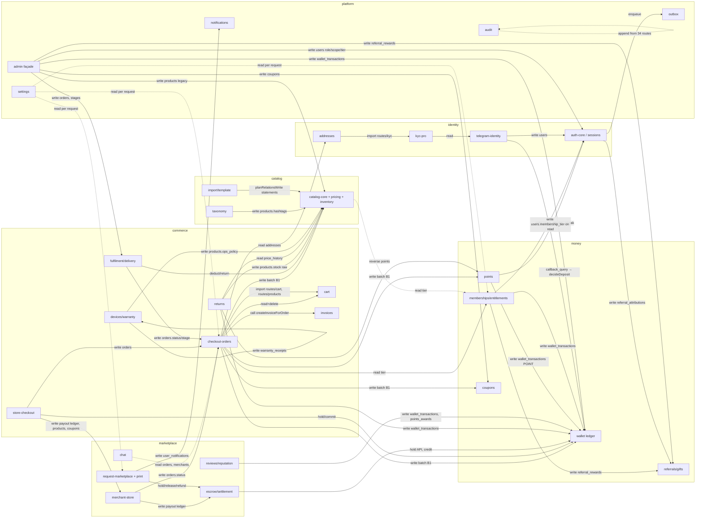

# LEVONIS — Architecture Assessment (monolith → progressive microservices on Cloudflare)

Date: 2026-09-07. Tree: `243f479`. Scope: `worker/` (47 route files, 35,672 LOC; 78 lib files, ~34,500 LOC), `migrations/` (52 files, 0001–0054; 146 `CREATE TABLE` statements → 137 final tables after renames), `src/` (React SPA), `studio/` (second Worker), `.github/workflows/` (29 workflows), `docs/`. 109 unit-test files under `tests/`.

Method: eight cluster maps (identity, catalog, commerce, money, marketplace, platform, frontend/infra, plus a mechanical table×writer matrix) were compiled here; every HIGH finding and every claim that decides a boundary was re-read in the current tree before being kept. Where a statement is inference rather than observation it is marked **GUESS**. Three map claims were corrected during verification and are marked **CORRECTION**. Secret and variable NAMES are quoted; no values.

---

## الملخّص التنفيذي (بالعربية)

المنصّة اليوم Worker واحد (Hono) بقاعدة D1 واحدة وحاوية R2 واحدة وكرون واحد كل ١٥ دقيقة يخدم ٤٧ ملف مسارات، مع Worker ثانٍ مستقل فعلًا هو LEVO Studio (قاعدته وحاويته الخاصة). حدّدنا **٤٧ سياقًا محدودًا** (خدمة ضمنيّة) داخل الـWorker الرئيسي زائد ٦ طبقات بنية تحتية (البوابة/الجلسة، الملفات، الرسائل الصادرة، الإعدادات، التدقيق، خط النشر).

الاقتران الأخطر ليس في الاستيرادات بل في **معاملات D1 التي تعبر أكثر من مجال**: دفعة الشراء (`orders.ts:1318-1493`) تكتب في جداول سبعة مجالات (الطلبات، الكوبونات، النقاط، المحفظة مرّتين، المخزون، السلّة، التسويات) وتعتمد على حِيَل CHECK لإبطال الدفعة بأكملها عند عدم كفاية الرصيد؛ لا يمكن تفكيكها إلا إلى Saga بمفاتيح تكرار موجودة أصلًا (`wtx_ord_<id>`, مفاتيح `inventory_ledger`).

**جدول `wallet_transactions` يكتبه ١٢ ملفًا من ٦ مجالات**، و`orders` يكتبه ٨ ملفات، و`users` تكتبه ثلاثة مجالات غير الهويّة (العضويات عند كل قراءة، المهمّات اليومية، لوحة الإدارة). هذه هي الكتابات التي يجب أن تتحوّل إلى أوامر عبر Service Bindings أو أحداث قبل أي فصل.

**نتائج مالية يجب إصلاحها قبل التفكيك**: (١) حجز المحفظة في طلبات المتاجر والضمان المجتمعي يُثبَّت (`commitHold`) دون أي قيد سحب في الدفتر، فيعود رصيد الزبون المتاح كما كان (`storeOrders.ts:344`, `escrowOps.ts:240,336`) — ويزيد الأمر أن إلغاء الزبون عبر `/api/orders/:id/cancel` يردّ `wallet_applied_usd_cents` التي لم تُخصم أصلًا؛ (٢) مسار قرار الودائع القديم في `admin.ts:449-511` يتجاوز حارس عدم تطابق المبلغ، والائتمان اليدوي `admin.ts:514-526` بلا مفتاح تكرار وبلا بوابة النطاق المالي؛ (٣) سبع واجهات إدارية خارج `/api/admin/*` لا يحميها حارس النطاق الرئيسي فتصل إليها صفحة تاجر بكوكي إدمن زائر.

**الترتيب المقترح**: بوابة API أولًا (نقل البرمجيات الوسيطة كما هي وإغلاق فجوة الحارس)، ثم الأوراق الخارجية (Studio عبر Service Binding، الرسائل الصادرة إلى Queue، مزرعة الطابعات، الملفات/الوسائط، السياسات، الفواتير، المحادثات، الإشعارات، الدعم، الاستثمار)، ثم الكتالوج والسوق، ثم الطلبات كـSaga، وأخيرًا نواة المال (المحفظة+النقاط+الدفتر معًا) والهويّة — مع الانتقال إلى PostgreSQL عبر Hyperdrive للـKYC أولًا ثم دفتر المال. لا يُحذف أي سلوك؛ البوابة توجّه بادئة المسار إلى الخدمة الجديدة والمونوليث يستمر في خدمة الباقي.

---

## 1. Implicit services (bounded contexts) found

Isolation score: **0** = no own tables, or writes other domains' rows inside its own D1 batches; **1** = own tables but foreign writers exist or it writes foreign tables in-request; **2** = own tables, cross-domain access is read-only or already behind one lib with idempotency keys; **3** = already a separate Worker/trust boundary. LOC = route file(s) + the libs that belong only to the context (approximate, `wc -l`).

### 1.1 Identity cluster

| Context | Routes (prefix) | Owned tables | Files | LOC | External | Iso |
|---|---|---|---|---|---|---|
| **auth-core** — accounts, credentials, sessions, email verification, Google sign-in, email-first signup | `/api/auth/*` (minus telegram sub-tree); global `loadSessionUser` on every request (`worker/index.ts:72-75`) | `users` (identity cols), `sessions`, `password_reset_tokens`, `email_verification_tokens`, `pending_signups`, `rate_limits` (infra) | `routes/auth.ts:1-1126,1597-1843`, `lib/session.ts`, `lib/crypto.ts`, `lib/google.ts`, `lib/usernames.ts`, `lib/http.ts`, `lib/hosts.ts`, `lib/appOrigin.ts`, `lib/securityPolicy.ts` | ~2,900 | Google JWKS (`lib/google.ts:112-124`), Resend (sync in-request `auth.ts:1812-1841`), Telegram getMe | 1 (foreign writers of `users`: `admin.ts:298`, `entitlements.ts:125-131`, `rewards.ts:104`) |
| **telegram-identity** — phone proof, OTP, Telegram sign-in/up, link, bot webhook | `/api/auth/telegram/*`, `/api/telegram/*` (incl. `/webhook`, `/admin/*`) | `telegram_links`, `link_challenges`, `otp_challenges`, `telegram_updates` | `routes/auth.ts:1127-1595`, `routes/telegram.ts`, `lib/telegram.ts:1-600`, `lib/phone.ts` | ~1,900 | Telegram Bot API | 1 (creates `users` rows in its own batch `auth.ts:1505-1527`; webhook dispatches money callbacks `telegram.ts:424-429`) |
| **profile** — profile cols, username, avatar, onboarding | `/api/profile/*` (also hosts foreign `favorites`, `warranty-claims`) | profile columns on `users` | `routes/profile.ts`, `lib/profileCompletion.ts` | ~400 | R2 `avatars/` | 1 (reads `audit_log` as state `profile.ts:48-53`; writes `favorites`, `warranty_claims`) |
| **addresses** | `/api/addresses/*` | `addresses` | `routes/addresses.ts`, `lib/iraqGovernorates.ts` | ~250 | — | 2 (read at checkout `orders.ts:486`, `storeOrders.ts:232`; PRO pricing `entitlements.ts:180-240`) |
| **kyc-pro** — identity verification, approved PRO address, phone-change review | `/api/kyc/*` (incl. `/admin/*`) | `kyc_cases`, `approved_addresses`, R2 `kyc/<uid>/` | `routes/kyc.ts`, `lib/sealbox.ts` | ~1,000 | R2 (private) | 2 (sealbox AES-GCM; own secret `KYC_ENC_KEY`) |
| **studio-sso** — single-use handoff + introspect | `/api/studio/handoff/*` | `studio_handoff_codes` | `routes/studio.ts` | ~260 | Studio Worker over public HTTPS + bearer (`studio/worker/auth/callback.ts:141-148`, `session.ts:379-383`) | 2 |

### 1.2 Catalog cluster

| Context | Routes | Owned tables | Files | LOC | External | Iso |
|---|---|---|---|---|---|---|
| **storefront-catalog-read** (+ home-content) | `GET /api/products*`, `/api/products/:slug/quote`, `GET /api/home`, `GET /api/bundles`, `GET /api/settings/public` | none (read model) | `routes/products.ts`, `lib/productOverlay.ts`, `lib/homeContent.ts`, `lib/availability.ts` | ~1,900 | — | 2 (pure reads; needs tier via `entitlements.pricingTierContext` `products.ts:387`) |
| **product-catalog-core** — ProductDoc, structure, placements | `/api/admin/products-v2/*`, `/api/admin/products/:id/relations`, legacy `/api/admin/products` (`admin.ts:357-407`) | `products`, `product_option_groups`, `product_option_values`, `product_colors`, `product_color_option_links`, `product_variants`, `product_images`, `product_facets`, `product_catalogs`, `product_translations` | `routes/adminProducts.ts`, `routes/adminProductRelations.ts`, `lib/productModel.ts`, `lib/productRelations.ts`, `lib/translate/*` | ~4,800 | — | 1 (`products` row written by 4 domains: price grid, inventory, devices `devices.ts:1220`, legacy admin `admin.ts:384/403`, hashtags `hashtags.ts:184`) |
| **pricing** — quick-edit grid, reprice, price history | `/api/admin/products/:id/price-grid*`, `/price-history`, `/products-v2/:id/reprice|quote` | `price_history` | `routes/adminPriceGrid.ts`, `lib/pricing.ts`, `lib/priceGrid.ts`, `lib/pinnedPrices.ts`, `lib/cheapestBase.ts` | ~3,400 | — | 1 (writes price columns on catalog rows `adminPriceGrid.ts:340-366`) |
| **inventory** — stock, reservations, ledger | `/api/admin/products/:id/stock*`; mutated by checkout/confirm/cancel/returns | `inventory_ledger`; stock COLUMNS on catalog rows | `lib/inventory.ts`, `lib/orderInventory.ts`, `routes/adminProductRelations.ts:106-256,912-965` | ~900 | — | 0 (statements appended to the checkout batch `orders.ts:1464-1486`; 5 ledger bypasses §2.1) |
| **taxonomy** — catalogs, brands, facets, hashtags | `/api/admin/taxonomy/*`; duplicate CRUD `/api/admin/products-v2/brands|catalogs` (`adminProducts.ts:315-507`) | `catalogs`, `brands`, `facets`, `hashtags` | `routes/adminTaxonomy.ts`, `lib/templateFamilies.ts`, `lib/hashtags.ts`, `lib/lookups.ts`, `lib/printerIdentity.ts` | ~1,700 | — | 1 (rewrites `products.hashtags` `hashtags.ts:184`) |
| **product-import-and-template** | `/api/admin/template/*`, `/api/admin/import/*` | `product_imports` | `routes/template.ts`, `routes/adminImport.ts`, `lib/template.ts`, `lib/importCsv.ts`, `lib/importApply.ts`, `lib/templateRelations.ts` | ~7,600 | R2 `products/import/`, outbound image fetch (SSRF-guarded) | 1 (writes products via `planRelationsWrite` statements; uses `rate_limits`/`audit_log` as idempotency store `template.ts:844-892`) |
| **media-ingest** | `POST /api/admin/media/ingest` | none (R2 `products/`) | `routes/media.ts`, `lib/pageImages.ts`, `lib/fetchGuard.ts` | ~900 | arbitrary admin URLs + vendor pages, R2 | 2 |
| **bundles** | `/api/bundles`, `/api/admin/bundles/*` | `bundles`, `bundle_items` | `routes/bundles.ts` | ~290 | — | 2 |
| **localization** — deterministic translations + Gemini helper | none own; `POST /api/translate` (`misc.ts:18-56`) | `product_translations` | `lib/translate/*`, `routes/misc.ts` | ~600 | Google Gemini (`misc.ts:29-46`, `GEMINI_API_KEY`) | 2 |

### 1.3 Commerce cluster

| Context | Routes | Owned tables | Files | LOC | External | Iso |
|---|---|---|---|---|---|---|
| **cart** | `/api/cart/*` | `cart_items` | `routes/cart.ts`, `lib/cartSeller.ts`, `lib/shippingType.ts` | ~1,300 | — | 2 (checkout reads/deletes rows directly `orders.ts:475,1456`, `storeOrders.ts:340`) |
| **checkout-orders (platform)** | `/api/orders/*`, `/api/admin/orders*` (list/detail/legacy status) | `orders`, `order_items`, `order_payment_settlements` | `routes/orders.ts`, `routes/admin.ts:529-750,1406-1560`, `lib/paymentPolicy.ts`, `lib/shipping.ts`, `lib/supportCode.ts`, `lib/policyOps.ts` | ~4,300 | Telegram (`orders.ts:1570`), Resend via `createInvoiceForOrder` (`lib/invoices.ts:331`, synchronous) | 0 (the 7-domain batch `orders.ts:1318-1493`) |
| **merchant-store-checkout** | `/api/store-orders/*`, `/api/merchant/orders*` | rows in `orders` WHERE `seller_type='merchant'` | `routes/storeOrders.ts`, `routes/merchant.ts:1190-1340` | ~550 | — | 0 (batch spans orders + 4 marketplace tables `storeOrders.ts:271-342`; hold before/commit after) |
| **fulfilment-tracking-delivery (Al-Waseet)** | `/api/admin/orders/:id/stage|stages|delivery*`, `/api/admin/delivery/*`, `/api/admin/labels`, receipts/labels, `GET /api/orders/:id/tracking`; cron */15 | `order_status_history`, `delivery_status_map`; `orders.stage/next_stage*/delivery_*` COLUMNS | `lib/orderStages.ts`, `lib/orderStageOps.ts`, `lib/delivery/*`, `lib/receipts.ts`, `routes/admin.ts:760-1405` | ~2,700 | Al-Waseet Merchant API (wire unconfigured: `alwaseet.ts:68-76` `DEFAULT_WIRE` empty paths) | 1 (rewrites `orders.status` `orderStageOps.ts:157-171`) |
| **returns-price-protection** | `/api/returns/*`, `/api/price-protection/*` | `return_cases`, `price_protection_claims` | `routes/returns.ts` | ~760 | Telegram | 1 (writes `wallet_transactions` `returns.ts:342,733`; raw `products.stock` `returns.ts:383-385`) |
| **invoices** | `/api/invoices/*` | `invoices` | `routes/invoices.ts`, `lib/invoices.ts`, `lib/emailTemplates.ts` | ~1,200 | Resend via outbox | 2 |
| **devices-warranty-claims** | `/api/devices/*` (incl. `/admin/*`), `GET /api/orders/:id/units`; legacy `profile.ts:270-296`, `admin.ts:1837-1856` | `order_item_units`, `device_serials`, `device_registrations`, `warranty_claims`, `claim_messages`, R2 `claims/<uid>/` | `routes/devices.ts`, `lib/deviceOps.ts`, `lib/warrantyPlans.ts` | ~1,900 | R2 | 1 (writes `warranty_receipts` in replace batch `devices.ts:1033-1040`; `products.ops_policy` `devices.ts:1207-1220`) |
| **warranty-receipts** | `/api/warranty/*` (public verify), `/api/admin/warranties/*` | `warranty_receipts`, `admin_settings.warrantyConfig` | `routes/warranty.ts`, `lib/warranty.ts`, `lib/warrantyConfig.ts`, `lib/warrantyDoc.ts`, `lib/qr.ts` | ~2,100 | — | 2 |

### 1.4 Money cluster

| Context | Routes | Owned tables | Files | LOC | External | Iso |
|---|---|---|---|---|---|---|
| **wallet-ledger-treasury** | `/api/wallet/*` (incl. `/admin/*`), legacy `/api/admin/wallet-requests*`, `/api/admin/wallet/credit`; Telegram callback branch; cron steps 8–9 | `wallet_transactions` (USD **and** POINT), `wallet_holds`, `wallet_withdrawals`, `wallet_deposit_meta`, `wallet_adjustments`, `wallet_review_requests` | `routes/wallet.ts`, `lib/walletOps.ts`, `lib/wallet.ts`, `routes/admin.ts:125-175,415-526` | ~2,300 | Telegram (approval buttons), Resend via outbox, R2 receipts | 0 (ledger written by 12 files across 6 domains; §2.1) |
| **wallet-approval-telegram-bridge** | none own (webhook `telegram.ts:427`, cron step 8, `telegram.ts:657-839` admin ops) | `tg_admin_notifications`, `tg_admin_actions`, `admin_tg_identities` | `lib/walletNotify.ts`, `routes/telegram.ts:657-839` | ~1,600 | Telegram sendPhoto/edit/answer, R2 | 1 (dynamic `import('./walletOps').decideDeposit` `walletNotify.ts:984`) |
| **points-missions** | `/api/rewards/*`, `POST /api/orders/:id/settlement` (`orders.ts:1833`), cron step 7 | `points_accruals`, `points_reservations`, `points_awards`, `reward_claims`, `browse_sessions` | `routes/rewards.ts`, `lib/pointsOps.ts` | ~1,200 | — | 0 (POINT rows live in `wallet_transactions`; statements embedded in checkout batch `orders.ts:1417-1454`; writes `users.checkin_streak` `rewards.ts:104`) |
| **memberships-entitlements** | `/api/memberships/*`, `/api/subscription/*` | `membership_plans`, `memberships`, `admin_settings.launchConfig` | `routes/memberships.ts`, `routes/subscription.ts`, `lib/entitlements.ts`, `lib/membershipOps.ts:27-146` | ~1,900 | — | 1 (`getTierStatus` writes `users` on every read `entitlements.ts:125-131`; purchase debit in own batch `memberships.ts:509-558`) |
| **coupons (platform)** | `/api/admin/coupons/*` (`admin.ts:1570-1687`); `validateCoupon` from cart/checkout | `coupons`, `coupon_redemptions` (written only by checkout `orders.ts:1348-1353`; trigger `0049:29-40`) | `routes/admin.ts:1570-1687`, `lib/membershipOps.ts:281-365` | ~250 | — | 1 |
| **referrals-support-gifts** | `/api/referrals/*`, `/api/memberships/referral/enter`, `/api/memberships/admin/referrals*`; cron step 10 | `referral_codes`, `referral_attributions`, `referral_rewards`, `support_gift_entitlements` | `routes/referrals.ts`, `lib/supportCode.ts`, `lib/membershipOps.ts:148-875` | ~1,700 | — | 1 (attribution written by auth `auth.ts:206-221`; rewards cancelled by admin `admin.ts:1509`) |
| **invest** | `/api/invest/*`, `/api/admin/invest/*` | `investments`, `investment_items`, `investor_messages` | `routes/invest.ts`, `routes/admin.ts:1855-1978` | ~200 | — | 2 |

### 1.5 Marketplace cluster

| Context | Routes | Owned tables | Files | LOC | External | Iso |
|---|---|---|---|---|---|---|
| **merchant-store** — identity, storefront, catalogue, builder, follows/favorites | `/api/merchant/*` (minus printers/prefs/matches), `/api/storefront/*`, `/api/community/*` (legacy), `/api/community-favorites/*`, follows in `/api/community-reviews/*` | `community_merchants`, `merchant_stores`, `merchant_store_slugs`, `reserved_slugs`, `merchant_notification_preferences`, `community_products`, `merchant_store_sections`, `merchant_services`, `merchant_showcase`, `merchant_coupons`, `community_product_favorites`, `follows`, `merchant_store_analytics_daily` (dead) | `routes/merchant.ts`, `routes/storefront.ts`, `routes/community.ts`, `routes/communityFavorites.ts`, `lib/merchantAuth.ts`, `lib/merchantOps.ts`, `lib/hosts.ts`, `lib/mediaRefs.ts` | ~3,700 | R2 `community/`, wildcard DNS | 1 (moves `orders.status` and `merchant_payout_ledger` in one batch `merchant.ts:1302-1338`) |
| **request-marketplace** (+ print-requests, same aggregate) | `/api/marketplace/*`, `/api/marketplace/print/*`, `/api/merchant/printers|request-prefs|request-matches` | `community_requests`, `community_request_files`, `community_offers`, `community_orders`, `community_order_items` (dead), `community_complaints`, `community_complaint_messages` (no writer), `merchant_printers`, `merchant_request_prefs`, `community_print_requests`, `community_request_matches`, `model_view_tokens` | `routes/marketplace.ts`, `routes/printRequests.ts`, `routes/merchantPrinters.ts`, `lib/communityStates.ts`, `lib/attachments.ts`, `lib/printMatching.ts`, `lib/printPricing.ts`, `lib/modelGeometry.ts`, `lib/externalModels.ts` | ~5,400 | R2 `requests/`, `request-previews/`; model-host APIs (SSRF-guarded) | 1 (accept flow drives escrow + wallet holds `marketplace.ts:704-751`; writes `user_notifications` `printRequests.ts:498-516`) |
| **escrow-settlement** (Payments/Settlement) | none own; via marketplace/merchant/adminCommunity | `community_escrows`, `community_escrow_events`, `merchant_payout_ledger` | `lib/escrowOps.ts`, `lib/merchantOps.ts:106-193`, `routes/adminCommunity.ts:662-777` | ~700 | — | 1 (calls `walletOps` hold API; **debit never posted** §5) |
| **merchant-reviews-reputation** | `/api/community-reviews/*`, `/api/storefront/:slug/reviews`, `/api/merchant/reviews*`, admin moderation | `merchant_reviews`, `merchant_reputation_events`; rating/badge/verified/status COLUMNS on `community_merchants` | `routes/merchantReviews.ts`, `routes/adminCommunity.ts:143-305,470-583` | ~700 | — | 1 |
| **chat** | `/api/chats/*`, `GET /files/chat/*` | `chats`, `chat_participants`, `chat_messages` | `routes/chats.ts`, `routes/uploads.ts:118-129` | ~230 | R2 `chat/` | 2 (reads `orders`+`community_merchants` for authz `chats.ts:68-74,120-124`) |
| **product-reviews-gifts** (belongs to Catalog/Loyalty, not marketplace) | `/api/reviews/*` (incl. `/admin/*`) | `reviews`, `review_rewards`, `gift_entitlements`, `gift_pool_items`, `gift_redemptions`, `gift_pools` (unused) | `routes/reviews.ts` | ~1,300 | R2 `reviews/`, `reviews-evidence/` | 1 (mints POINT rows `reviews.ts:1112-1125`) |
| **community-admin BFF** | `/api/admin/community/*` | none | `routes/adminCommunity.ts` | ~780 | — | 0 (writes 10 other contexts' tables) |

### 1.6 Platform / cross-cutting

| Context | Routes | Owned tables | Files | LOC | External | Iso |
|---|---|---|---|---|---|---|
| **support-restrictions** | `/api/support/*` (incl. `/admin/*`, public `/assistant`) | `support_tickets`, `support_ticket_messages`, `restriction_cases` | `routes/support.ts` | ~1,450 | — | 2 (reads 12 foreign tables; `restriction_cases` consumed by `entitlements.ts:95` — **CORRECTION** to the platform map: restrictions ARE wired into entitlements; only the `activeRestrictionFlags` export is orphaned) |
| **notifications-inbox** | `/api/notifications/*` | `user_notifications` | `routes/notifications.ts`, `lib/notifications.ts` | ~140 | — | 2 (single producer `printRequests.ts:495-525` in a marketplace batch) |
| **outbox-messaging** | none; cron step 1 + `waitUntil` pumps (`auth.ts:410,507,1632`, `invoices.ts:174`, sync `lib/invoices.ts:331`) | `outbox` | `lib/outbox.ts`, `lib/emailTemplates.ts` | ~800 | Resend (Idempotency-Key = event_key `outbox.ts:70-78`), Telegram | 2 |
| **policies** | `/api/policies/*` (incl. `/admin/*`) | `policy_documents`, `policy_acceptances` | `routes/policies.ts`, `lib/policyOps.ts` | ~1,200 | — | 2 (checkout records acceptance `orders.ts:1278` via `policyOps.ts:73-100`) |
| **settings-config** | `GET /api/settings/public`, `GET/PUT /api/admin/settings*` (`admin.ts:1690-1807`) | `admin_settings` | `lib/settings.ts`, `routes/misc.ts:12-15` | ~450 | — | 0 (6 writer files, ~26 reader files; `settings.ts:2-6` imports defaults from 5 domains) |
| **audit** | none (34 route files call `audit()`; read as state by `profile.ts:49`, `template.ts:878`, `warranty.ts:298`) | `audit_log` | `lib/audit.ts` | ~20 | — | 1 |
| **admin-console façade** | `/api/admin/*` remainder (`routes/admin.ts`: providers, overview, users, legacy products, wallet, orders, delivery, labels, coupons, settings, warranty-claims, invest) | `users.admin_scope` concept only | `routes/admin.ts`, `lib/adminScope.ts` | ~2,300 | Telegram, Al-Waseet | 0 (writes 8 domains' tables) |
| **files-uploads** | `POST /api/uploads`, `GET /files/*` | none (R2 prefixes `products/ avatars/ receipts/<uid>/ chat/<uid>/ community/<uid>/`) | `routes/uploads.ts` | ~150 | R2 | 2 (chat authz reads chat tables `uploads.ts:123-129`) |
| **printer-farm (game)** | `/api/farm/*`, `/api/admin/farm/*` | `farm_profiles`, `farm_ledger`, `farm_printers`, `farm_spools`, `farm_jobs`, `farm_assignments`, `farm_events`, `farm_daily`, `farm_achievements`, `farm_requests` | `routes/farm.ts`, `routes/farmAdmin.ts`, `lib/farm/*` | ~3,000 | — | 2 (no foreign writers; one config key `printerFarmConfig`; no wallet coupling — `farm/config.ts:859-860`) |
| **misc utilities** | `/api/health`, `/api/translate` | — | `routes/misc.ts` | ~60 | Gemini | 2 |

### 1.7 Infrastructure seams (not domains, but each is a Worker boundary in the target)

| Seam | Where today | Notes |
|---|---|---|
| **edge-gateway** (host classification, session, CSRF/origin, security headers, apex-only admin guard, rate limiter, mount table) | `worker/index.ts:57-104`, `lib/http.ts:57-104`, `lib/hosts.ts`, `lib/session.ts:56-79`, `lib/ratelimit.ts:30-65` | owns `rate_limits`; reads `sessions JOIN users` per request |
| **cron-orchestrator** | `worker/index.ts:220-224` → `lib/jobs.ts` (13 steps) | one `*/15` trigger across 7 domains |
| **SPA shell** | `src/` (Vite; `dist/` main chunk 2.96 MB / 817 KB gzip; 20 admin panels statically imported `src/pages/Admin.tsx:5-26`) | zero build-time secrets; same-origin only |
| **LEVO Studio Worker** | `studio/` (own D1, R2, Images; host-only cookie) | already isolation 3; talks to main over HTTPS + `STUDIO_HANDOFF_SECRET` |
| **deploy pipeline** | `wrangler.jsonc`, `scripts/*.mjs`, 29 workflows | one wrangler config, one D1, one R2, one cron; no KV/Queues/DO/Workflows/Service Bindings declared (grep of both wrangler files) |

**Count: 47 application bounded contexts + 6 infrastructure seams.**

---

## 2. Tangled dependencies

### 2.1 Hot tables written by several contexts (every writer, what the write does)

**`wallet_transactions`** — natural owner: wallet-ledger. Balance is never stored; it is `SUM` over approved rows (`lib/walletOps.ts:44-61`, `lib/wallet.ts:11-22`), so every writer is a co-owner.

| Writer | file:line | Write |
|---|---|---|
| wallet | `lib/walletOps.ts:956` (deposit request batch), `:560,690,757` (withdrawal state machine), `:1049` (admin decision batch), `routes/wallet.ts:752` (adjustment) | canonical paths |
| checkout | `routes/orders.ts:1389-1397` INSERT POINT withdrawal with in-statement balance guard (`-1` → CHECK abort); `:1401-1409` USD withdrawal via `usdSpendStatement` (`walletOps.ts:97-113`) | spends at checkout inside the order batch |
| order cancel (customer) | `routes/orders.ts:1773-1791` INSERT deposits `wtx_refund_<id>_usd` / `_pts` | refund after a separate status flip |
| order cancel (admin) | `routes/admin.ts:1485-1503` same ids, `created_by='admin'` | refund; does **not** cancel pending accrual / flip `points_reservations` (customer path does at `orders.ts:1795-1806`) |
| legacy admin decide | `routes/admin.ts:488-507` UPDATE status approved/rejected | bypasses `walletOps.decideDeposit` (`walletOps.ts:809-864`) — still called by `src/components/AdminWalletRequests.tsx:76`, `AdminOverview.tsx:133` |
| manual credit | `routes/admin.ts:524` → `lib/wallet.credit` | no idempotency key |
| returns | `routes/returns.ts:342-348` INSERT `wtx_ret_<caseId>`; `:733-738` INSERT `wtx_pp_<claimId>` | refund / price-protection credit, after a separate state flip |
| points engine | `lib/pointsOps.ts:548` (release `wtx_acc_<accrual>`), `:669` (legacy award), `:814` (claw-back, CHECK trick), `:883` (legacy reversal) | POINT credits/debits |
| rewards missions | `routes/rewards.ts:51` INSERT POINT deposit in claim batch | mission points |
| reviews | `routes/reviews.ts:1121-1124` INSERT `wtx_review_<id>` in batch with `points_awards` | review points |
| memberships | `routes/memberships.ts:518-531` `usdSpendStatement` inside purchase batch; `:1220-1224` refund `wtx_refund_<membershipId>` | subscription charge / refund |
| escrow | `lib/escrowOps.ts:339-346` `credit()` USD deposit for partial refund | no event key on the ledger row (idempotent only via `community_escrow_events`) |

**`orders`** — natural owner: checkout-orders.

| Writer | file:line | Write |
|---|---|---|
| checkout | `routes/orders.ts:1320` INSERT; `:1759` conditional cancel flip | |
| store checkout | `routes/storeOrders.ts:273-293` INSERT `seller_type='merchant'`, `origin='store_product'`, `stage='received'`, `wallet_applied_usd_cents` | second creator of the same table |
| merchant | `routes/merchant.ts:1303-1305` UPDATE status (own state machine, bypasses `orderStageOps`) | merchant-side fulfilment |
| admin | `routes/admin.ts:1297-1309` UPDATE delivery_*; `:1424-1434` UPDATE status/delivered_at | dispatch and legacy status |
| fulfilment | `lib/orderStageOps.ts:157-171` UPDATE stage+status+delivered_at; `:218-227` initOrderStage batch | stage machine rewrites the legacy status the money/stock code keys on |
| delivery sync (cron) | `lib/delivery/sync.ts:66-89` UPDATE delivery_*; `:112` `moveOrderStage(force:true)` | courier status |

Column-level ownership on the same row: money/status (Orders) · `stage/next_stage*/delivery_*` (Fulfilment, `0028:24-39`) · `seller_type/merchant_id/store_id/commission_percent_x100/platform_fee_iqd/merchant_receivable_iqd` (Merchant, `0030:240-251`) · `coupon_code/coupon_discount_iqd` (merchant coupons, `0036:110-111`) · `membership_gift`, `referral_delivery_waived` (memberships/referrals, `0047:21`, `0049:42`) · `support_snapshot` (referrals, `0014:57-61`).

**`products`** (and `product_option_values`, `product_colors`, `product_variants`) — natural owner: catalog-core.

| Writer | file:line | Write |
|---|---|---|
| catalog-core | `adminProducts.ts:737,910,918,1093,1187,1202`; `adminProductRelations.ts:641,668`; `template.ts:1304,1343`; `adminImport.ts:1098,1106` | doc/structure |
| pricing | `adminPriceGrid.ts:340-344` price/cost columns; `:394-400` JSON store; `:979-984` sale_types; `:362-366` option/colour price + **stock** (traits) | price grid |
| inventory | `lib/inventory.ts:487` UPDATE `${table}` stock/stock_reserved under guard (inside checkout/confirm/cancel batches) | reservations |
| returns | `routes/returns.ts:383-385` `UPDATE products SET stock = stock + ?` | raw restock, no ledger row, ignores option/colour scopes |
| devices | `routes/devices.ts:1207-1220` UPDATE `products.ops_policy` | serialization policy |
| legacy admin | `routes/admin.ts:384-389` INSERT…ON CONFLICT (JSON options/colors, cost, stock; bypasses `validateProductDoc`, `price_history`, translations); `:403` DELETE (hard; FK CASCADE removes `inventory_ledger` `0018:306`) | no `src/` caller (grep) |
| taxonomy | `lib/hashtags.ts:184` UPDATE `products.hashtags` in batches of 50 | hashtag rename/strip |

**`users`** — natural owner: auth-core.

| Writer | file:line | Write |
|---|---|---|
| identity | `routes/auth.ts` (16 sites incl. `:1505-1527` Telegram signup batch), `routes/profile.ts:86,168,195,205` | |
| admin console | `routes/admin.ts:298` UPDATE role / membership_tier / subscription_plan / admin_scope / is_investor (allow-listed columns `:262-296`, `userPatchRefusal`) | privilege + tier override |
| memberships | `lib/entitlements.ts:125-131` UPDATE membership_tier/subscription_plan/subscription_expiry on **every** `getTierStatus` call (16 route importers) | write-on-read cache |
| rewards | `routes/rewards.ts:104` UPDATE checkin_streak/last_checkin_day inside the points batch | gamification state |

**Other shared-written tables:** `warranty_claims` (`devices.ts:571,1139`; legacy `profile.ts:290`; legacy `admin.ts:1850` bypasses `CLAIM_TRANSITIONS`) · `merchant_payout_ledger` (`storeOrders.ts:335` pending sale_credit; `merchant.ts:1310-1313` → available, `:1331-1334` → reversed; `escrowOps.ts:243-274,367-375`; `adminCommunity.ts:767-770` payout) · `merchant_coupons` (`merchant.ts:1882-1950`; `storeOrders.ts:299-303` used_count) · `community_products` (`merchant.ts` ×7, `community.ts:335,345` legacy, `storefront.ts:303` view_count, `adminCommunity.ts:282` hide, `storeOrders.ts:324-327` stock/sold_count) · `community_merchants` (store identity; rating/badge `merchantReviews.ts:63-68`; verified/status/badge_override `adminCommunity.ts:168,200,222`; completed_orders `merchant.ts:1322`, `marketplace.ts:916`) · `community_requests`/`community_request_files` (marketplace owns; print writes spec/analysis `printRequests.ts:188-195,419-424,923-938,970-981`; legacy `community.ts:158-171`) · `referral_rewards` (`memberships.ts:732` write-on-read, `:1238`, `:1341`; `admin.ts:1509`; `membershipOps.ts:381`) · `referral_attributions` (`auth.ts:206-221`; `membershipOps.ts:220`) · `memberships` (`memberships.ts`; `entitlements.ts:70-75` expiry on read; `membershipOps.ts:113-125` gift) · `points_awards` (`reviews.ts:1119`; `pointsOps.ts:660,877`) · `investor_messages` (`invest.ts:40`; `admin.ts:1973`) · `admin_settings` (typed: `admin.ts:1806`, `farmAdmin.ts:103,124`, `warranty.ts:210`, `memberships.ts:966`; raw: `adminCommunity.ts:131-137`, `lib/telegram.ts:117-121`) · `link_challenges`/`telegram_links` (telegram + `auth.ts:1243,1247,1354,1446,1518,1523`) · `warranty_receipts` (`warranty.ts`; `devices.ts:1033-1040`).

### 2.2 Cross-context `db.batch()` transactions (97 batch sites total; these are the ones that span domains)

| # | Site | Tables in one transaction | Domains | Atomicity mechanism |
|---|---|---|---|---|
| B1 | `routes/orders.ts:1318-1493` (checkout) | `orders`, `order_items`, `coupon_redemptions`, `points_reservations`, `wallet_transactions` ×2, `points_accruals`, `order_payment_settlements`, `cart_items` DELETE, `inventory_ledger` + stock counters on 4 catalog tables | Orders, Coupons, Points, Wallet, Cart, Inventory, Settlements | single D1 batch; CHECK(amount>0) abort trick (`orders.ts:1389-1397`, `walletOps.ts:99-113`); coupon trigger `0049:29-40`; stock guards `inventory.ts:461-488` |
| B2 | `routes/orders.ts:1770-1810` (customer cancel) | `wallet_transactions` ×2, `points_reservations`, `points_accruals` | Wallet, Points | batch AFTER a separate `orders` flip (`:1759`) and separate inventory writes (`:1768`) |
| B3 | `routes/admin.ts:1485-1490` (admin cancel) | `wallet_transactions` ×2 | Wallet ← Orders | after flip `:1424-1434`; then `referral_rewards` `:1509` separately |
| B4 | `routes/storeOrders.ts:271-342` (store checkout) | `orders`, `order_items`, `merchant_coupons`, `community_products`, `merchant_payout_ledger`, `cart_items` | Orders, Merchant, Settlement, Cart | `createPurchaseHold` BEFORE (`:249`), `commitHold` AFTER (`:344`) — three non-atomic steps |
| B5 | `routes/merchant.ts:1302-1338` (merchant status) | `orders`, `merchant_payout_ledger`, `merchant_reputation_events`, `community_merchants` | Orders, Settlement, Reputation, Store | one batch |
| B6 | `routes/marketplace.ts:903-919` (confirm) | `community_orders`, `community_requests`, `merchant_reputation_events`, `community_merchants` | Marketplace, Reputation | after `releaseEscrow` (`escrowOps.ts:228-274`: 3 phases) |
| B7 | `routes/reviews.ts:1112-1125` | `review_rewards`, `points_awards`, `wallet_transactions` | Reviews, Points, Wallet | one batch; deterministic id |
| B8 | `routes/rewards.ts:46-55` + `:104` | `reward_claims`, `wallet_transactions`, `users` | Rewards, Wallet, Identity | one batch; UNIQUE(user,mission,day) |
| B9 | `routes/memberships.ts:509-558` (purchase) | `wallet_transactions`, `memberships` ×n | Memberships, Wallet | CHECK 'conflict' trick + partial UNIQUE `0052:60` |
| B10 | `lib/pointsOps.ts:534-561` (release) | `points_accruals` ×3, `wallet_transactions` | Points, Wallet | single-winner token |
| B11 | `routes/devices.ts:1005-1060` (replace) | `order_item_units`, `device_registrations`, `device_serials`, `warranty_receipts` | Devices, Receipts | one batch |
| B12 | `routes/printRequests.ts:495-537` (publish) | `community_request_matches`, `user_notifications` | Marketplace, Notifications | one batch; `notifyStatement` designed to ride in the caller's batch (`lib/notifications.ts:66-72`) |
| B13 | `routes/auth.ts:1505-1527` (Telegram signup) | `users`, `telegram_links`, `link_challenges` | Auth, Telegram-identity | one batch with NOT EXISTS guards |
| B14 | `lib/escrowOps.ts:149-186` (hold) | `wallet_holds` (separate) then `community_escrows` + `community_escrow_events` | Wallet, Settlement | sequential; orphan hold possible on crash |
| B15 | `routes/adminCommunity.ts:130-137` | `admin_settings` | Config ← Marketplace admin | batch upsert of fee keys |
| B16 | `lib/orderStageOps.ts:218-227` / `:157-184` | `orders`, `order_status_history` (+ inventory via `deductOrderStock/returnOrderStock` `:186-197`) | Fulfilment, Orders, Inventory | conditional flip |

Intra-domain batches that are fine to keep: `auth.ts:1098-1101` (users+sessions), `walletOps.ts:701-737` (withdrawal paid), `wallet.ts:733-757` (adjustment), `farm.ts` sim batches, `addresses.ts:78-92,134-137`, `kyc.ts:746-769,821-831`.

### 2.3 Shared libs that carry domain logic for several contexts

| Lib | Fan-in | Domain logic it carries | Writes |
|---|---|---|---|
| `lib/entitlements.ts` | 16 route files, 5 clusters | tier oracle (`getTierStatus`), PRO pricing context (`pricingTierContext` reads `addresses`, `approved_addresses`, `restriction_cases`) | `memberships` expiry `:70-75`; `users` cache `:125-131` |
| `lib/membershipOps.ts` | 8 route files + cron | coupons validation, referral attribution/rewards, printer gift, support-gift engine, `addMonths` | `memberships`, `referral_*`, `support_gift_entitlements`; reads `orders`, `order_items`, `return_cases`, `products`, `catalogs` |
| `lib/pointsOps.ts` | orders, admin, returns, reviews (indirect), cron | accrual/settlement/release/reversal; `order_payment_settlements` writer | `wallet_transactions`, `points_*`, `order_payment_settlements` |
| `lib/walletOps.ts` | 11 route files, 5 clusters | holds, spend statement, withdrawals, deposit decision, reconciliation | 4 wallet tables |
| `lib/inventory.ts` + `lib/orderInventory.ts` | 10 route files, 3 clusters | reserve/deduct/release/restore planning | `inventory_ledger`, stock columns on 4 catalog tables |
| `lib/escrowOps.ts` | marketplace, adminCommunity, storeOrders (fee/rate helpers) | escrow state machine, merchant balance | `community_escrows`, `community_escrow_events`, `merchant_payout_ledger`, `wallet_holds` |
| `lib/orderStageOps.ts`, `lib/delivery/sync.ts` | orders, admin, cron | stage machine, courier mapping | `orders`, `order_status_history` |
| `lib/deviceOps.ts` | devices, admin, warranty, support | unit creation on delivery, coverage | `order_item_units`, `device_serials` |
| `lib/telegram.ts` | 6 route files, 4 clusters | identity helpers (`:145-586`) AND wallet transport (`:588-785`) behind ONE bot token / ONE webhook | `link_challenges`, `otp_challenges`, `admin_settings` (bot username cache `:117-121`) |
| `lib/settings.ts` | 22 files, 6 clusters | typed config; imports default constants from 5 domains (`settings.ts:2-6`) | `admin_settings` |
| `lib/audit.ts` / `lib/ratelimit.ts` | 34 / 35 route files | append-only audit (errors swallowed `audit.ts:14-16`); D1 fixed-window counter | `audit_log` / `rate_limits` |
| `lib/pricing.ts` + `lib/productOverlay.ts` + `lib/productRelations.ts` | products, cart, orders, returns, bundles, support, adminPriceGrid | price resolution that MUST be byte-identical between storefront and checkout (`cart.ts:188`, `returns.ts:565-590`) | none |
| `lib/printerIdentity.ts` | 8 files (cart, orders, devices, products, membershipOps, warrantyPlans, deviceOps, reviews) | `catalogs.is_printer_catalog` decides gifts/warranty/reviews | none |
| `lib/hosts.ts` | session, appOrigin, storefront, merchant, CI scripts | host classification = security boundary | none |

### 2.4 Route-to-route imports (break at compile time on any Worker split)

`orders.ts:9` ← `routes/cart` (resolveCartLine, pricingContextFrom, …); `orders.ts:21`, `cart.ts:30` ← `routes/products` (saleAvailability); `admin.ts:18,21` ← `routes/products` (productPublic), `routes/orders` (orderPublic, shippingConfigFrom, ORDER_ITEMS_SELECT); `support.ts:35` ← `routes/products` (pricingCtx, publicWithDisplayPrice); `bundles.ts:30`, `adminProducts.ts:38` ← `routes/products`; `rewards.ts:8` ← `routes/cart` (planIsActive); `addresses.ts:5` ← `routes/kyc` (getApprovedAddress, addressMatchesSnapshot); `kyc.ts:18`, `devices.ts:70`, `media.ts:7`, `reviews.ts:19`, `adminImport.ts:45` ← `routes/uploads` (sniff); `template.ts:39`, `adminImport.ts:47` ← `routes/adminProductRelations` (planRelationsWrite); `adminImport.ts:46` ← `routes/media` (ingestImageUrl); `adminCommunity.ts:31` ← `routes/merchantReviews` (refreshMerchantRating); `farmAdmin.ts:32` ← `routes/farm`; `subscription.ts` ← `routes/memberships`; `telegram.ts:27-31` ← `lib/walletNotify` (money into the identity webhook).

### 2.5 The cron whose steps span contexts

`worker/index.ts:220-224` → `lib/jobs.ts` runs 13 sequential, never-throwing steps in one `*/15` invocation: (1) outbox delivery [Messaging]; (2) `link_challenges` expiry [Telegram-identity]; (3–5) prune `otp_challenges`, `email_verification_tokens`, `password_reset_tokens` [Auth]; (6) prune `sessions` [Auth]; (7) `releaseDueAccruals` → `points_accruals` + `wallet_transactions` [Points/Wallet — MONEY]; (8) `processWalletNotifications` → `tg_admin_notifications` + Telegram [Wallet bridge]; (9) `reconcileWallets` → one audit row on anomaly [Wallet]; (10) `reconcileSupportGifts` → `support_gift_entitlements`, `memberships` [Referrals/Memberships]; (11) `sweepDueStages` → `orders.stage` + `order_status_history` [Fulfilment]; (12) `sweepDeliveryStatuses` → `orders.delivery_*` + Al-Waseet API, up to 100 sequential 15-s calls (`delivery/sync.ts:344-376`, `alwaseet.ts:175`) [Delivery]; (13) BNPL stub. Steps 11/12 also run on demand from `admin.ts:1338-1355`; step 1 from `auth.ts:410,507,1632`; step 8 from `telegram.ts:837`.

### 2.6 Dependency graph

---

## 3. Sensitive data inventory

| Context | Data | Stored in | Who can read today | Reaches the browser |
|---|---|---|---|---|
| auth-core | `password_hash` (PBKDF2 100k; legacy bcrypt re-hashed `crypto.ts:47-78`), `google_sub` | D1 `users` | loaded into memory on every request (`session.ts:63-69` `SELECT u.*`) and stripped at `:75`; never serialized (`types.ts:156`) | never (SECURITY.md §1 row 16) |
| auth-core | session token (only SHA-256 stored), reset/verify/signup tokens (hash only `auth.ts:487,1051,1619`) | D1 `sessions`, `*_tokens`, `pending_signups` | owner via cookie `levonis_session` HttpOnly Secure Lax `Domain=.<root>` (`session.ts:30-42`) | cookie only |
| auth-core | email, phone_e164 (PII) | D1 `users` | owner (`publicUser` masks phone `types.ts:161`); ANY admin incl. `admin_scope='assistant'` via ~25 JOINs (e.g. `admin.ts:602` full `u.phone_e164`, `admin.ts:229` search, `support.ts:1174`, `adminCommunity.ts:151,343,374,491`, `memberships.ts:849`, `kyc.ts:572`) | admin console shows full email/phone (`src/lib/api.ts:516-524`, `AdminUsers.tsx:175`) |
| auth-core | role, admin_scope, is_investor (privilege) | D1 `users` | written by `admin.ts:298` with `userPatchRefusal` policy | `can_view_financials` hint (`types.ts:144-146`) |
| telegram-identity | phone_e164, telegram_user_id, chat_id; OTP verifiers (salted sha256 `lib/telegram.ts:228,466`) | D1 `telegram_links`, `link_challenges`, `otp_challenges` | server; masked phone to owner (`auth.ts:1258,1309`) | masked only |
| kyc-pro | full name, DOB, document number (AES-256-GCM sealbox, key ring `KYC_ENC_KEY` `sealbox.ts:17-41`), evidence images | D1 `kyc_cases` (ciphertext), R2 `kyc/<uid>/` (private) | decrypted only in admin detail `kyc.ts:626-630` with per-view audit; **any** `role='admin'` incl. assistant (documented gap `kyc.ts:35-37`) | admin KYC screen (`src/components/AdminKyc.tsx:169-190`) |
| kyc-pro / addresses | approved PRO address incl. phone (`kyc.ts:439-444` — NOT E.164 normalised; `addresses.ts:11-16` regex only) | D1 `approved_addresses`, `addresses` | owner; entitlements hot path (`entitlements.ts:165,182`); checkout snapshot | owner |
| orders / fulfilment | `address_snapshot` (name, phone, address), COD amounts; courier PII (`admin.ts:1277-1291`), labels/receipts (`receipts.ts:399-428`) | D1 `orders` | owner; admin; **merchant** for store orders (`merchant.ts:1226-1259` customer name + phone) | yes (owner, admin, merchant) |
| store-checkout | `commission_percent_x100`, `platform_fee_iqd`, `merchant_receivable_iqd`, `admin_note`, `idempotency_key` | D1 `orders` | **customer** via `SELECT * FROM orders` (`storeOrders.ts:227-228,352-353`) and quote (`:203-205`) | **yes — internal commission to the buyer (HIGH, §5)** |
| wallet | USD/POINT ledger, holds, pending deposits, payout destination account numbers + holder names (`wallet_withdrawals.destination_*`, `withdrawalPublic` `wallet.ts:62-89`), legacy `account_number` | D1 wallet tables | owner; any admin (`wallet.ts:462-479`, `admin.ts:425-447`) — `canViewFinancials` applied only to `/api/admin/overview` (`admin.ts:163`) | owner + admin |
| wallet | deposit receipt images | R2 `receipts/<uid>/` (private; `uploads.ts:115-117` owner-or-admin) | owner, admin; **copied into the Telegram admin group** (`walletNotify.ts:731-741,798-807`) | via `/files/` |
| wallet bridge | single-use approval tokens (sha256 stored `0017:128`) | D1 `tg_admin_actions`; raw only in Telegram `callback_data` | Telegram group members with `admin_tg_identities` | no |
| memberships | price_paid_iqd, wallet_tx_id, launch/gift config | D1 `memberships`, `admin_settings` | admin list to any admin (`memberships.ts:849-869`) | admin |
| invest | investment amounts, expected profit, investor messages | D1 `investments*` | investor; any admin (`admin.ts:1866-1878`, no financial scope) | yes |
| catalog / pricing | `product_cost_iqd`, `cost_iqd`, `cost_adjust_iqd`, margin, `price_history` cost rows | D1 catalog rows, `price_history` | financial admins; stripped for assistant server-side (`adminScope.ts:82`, `adminProducts.ts:755,872,999`, `adminPriceGrid.ts:524-541,1309`) | **legacy `GET /api/admin/products` leaks cost to any admin** (`admin.ts:357-360` → `products.ts:519-527`) |
| settings | `printPricingConfig`, `printMaterials` (buy prices), `printMatchWeights`, `proPricingPolicy`, `minMarginPercent`, `communityFee*` (internal policy) | D1 `admin_settings` | **any admin** via `GET /api/admin/settings` (`admin.ts:1690-1693`, `requireAdmin` only) | admin |
| settings (public) | `exchangeRate`, `paymentMethods[].details` (manual bank instructions), home content, `printServicePricing` | D1 `admin_settings` | everyone (`PUBLIC_SETTING_KEYS` `settings.ts:286-306`) | yes, by design |
| marketplace | customer 3D models/drawings (IP) | R2 `requests/<uid>/`, `request-previews/` | owner / engaged merchant / admin (`marketplace.ts:335-346`); unauthenticated **viewer token** ≤168 h (`printRequests.ts:822-829`) | streamed |
| marketplace / escrow | escrow amounts, merchant balances, commission split | D1 `community_escrows`, `merchant_payout_ledger` | both parties by design (`marketplace.ts:802-814`); admin | yes |
| chat | private conversations, images | D1 `chat_*`, R2 `chat/<uid>/` | participants only (`uploads.ts:118-129`); no admin backdoor (SECURITY.md §3.9) | participants |
| reviews | Instagram evidence link/screenshot | R2 `reviews-evidence/<uid>/` | owner + admin (`reviews.ts:577-579,968-971`) | owner/admin |
| support | tickets, BNPL ledger/credit limit, KYC states, membership prices in member 360 | D1 | any admin incl. assistant (`support.ts:1297,1318-1329`) | admin |
| outbox | full rendered HTML incl. live reset/verify/signup links | D1 `outbox.payload` | DB readers; never pruned (`jobs.ts` prunes tokens, not outbox) | no |
| audit | actor, target, ≤4000-char detail; `admin.ts:301` stores the raw PATCH body | D1 `audit_log` | admin readers (`warranty.ts:298`) | partial |
| farm | in-game coins (not money `0053:5-9`), `offer_salt`, outcome seeds | D1 `farm_*` | player; admin console strips seeds (`farmAdmin.ts:152,164`); financial scope for limits/rewards (`farmAdmin.ts:41,79,116`) | leaderboard is public: username + avatar_key of every player (`farm.ts:566-569`) |
| studio | 3D model files (private R2), `studio_sessions` (user_id, display_name, locale only) | Studio D1/R2 | owner after ownership check | streamed |

**Provider secrets by env NAME** (Worker secrets): `TELEGRAM_BOT_TOKEN`, `TELEGRAM_WEBHOOK_SECRET`, `TELEGRAM_ADMIN_CHAT_ID`, `EMAIL_API_KEY`, `GEMINI_API_KEY`, `KYC_ENC_KEY`, `STUDIO_HANDOFF_SECRET`, `ALWASEET_BASE_URL`, `ALWASEET_USERNAME`, `ALWASEET_PASSWORD`. Vars: `GOOGLE_CLIENT_ID`, `INITIAL_ADMIN_EMAIL`, `EXTRA_ALLOWED_ORIGINS`, `APP_ORIGIN`, `EMAIL_ALLOWED_RECIPIENTS`, `EMAIL_FROM`, `STORE_ROOT_DOMAIN`, `STUDIO_ALLOWED_DESTINATIONS` (`wrangler.jsonc:47-63`); Studio: `APP_ORIGIN`, `MAIN_SITE_ORIGIN`, `STUDIO_*` quotas. Bindings: `DB`, `BUCKET`, `ASSETS` (+ `IMAGES` in Studio). No secret value reaches the client (`src/main.tsx:6-20`, SECURITY_AUDIT_2026-09.md).

---

## 4. Slow points

Each row: finding → cheap fix → architectural fix.

### 4.1 N+1 / sequential loops
- `admin.ts:1869-1877` invest detail: one `investment_items` query per investment; `invest.ts:299-315` same. → `IN (...)` join. → Invest Worker with a single read model.
- `lib/pointsOps.ts:585-603` `releaseDueAccruals` and `lib/membershipOps.ts:842-873` `reconcileSupportGifts`: per-order loop, 1–6 queries + a batch each, up to 200 per tick. → batch by order ids. → Workflow per order (`sleepUntil(available_at)`), triggered by `order.settled`.
- `lib/delivery/sync.ts:344-376`: up to 100 sequential courier fetches × 15 s timeout inside one cron `waitUntil`. → cap + concurrency. → Queue fan-out in the Fulfilment Worker.
- `lib/orderStageOps.ts:247-292` `sweepDueStages`: `getSetting`+SELECT+UPDATE+INSERT per due order. → preload settings once. → DO alarm / Workflow per order keyed on `next_stage_at`.
- `printRequests.ts:943-982` `/repeat`: per-file R2 GET+PUT + INSERT. → `Promise.all`. → Queue job.
- `chats.ts:25-43`: five correlated subqueries per chat row, ORDER BY computed column. → denormalise `last_message_at`, `unread_count`. → Durable Object per chat.
- `template.ts:544,501,524` one SELECT per catalog slug; `:563-586` per-row DELETE/INSERT + MAX(position) outside any batch. → batch. → catalog-core command.

### 4.2 Duplicate queries in one request
- `auth.ts:814,844,865` Google identity re-selects the user row up to 3×; `/login` re-reads after `createSession` (`:719`); `/signup/complete` (`:624`), `/telegram/complete` (`:1585`), `profile.ts:111`. → return the row from the write. → identity API returns the principal.
- `computeCheckout` runs `validateCoupon` up to twice (`orders.ts:823,895-899`) and the trigger recounts at insert (`0049`); prices the cart up to 3× in CPU (`:725-727`). → memoise per request. → checkout-session Durable Object.
- `cart.ts:325-328` `resolveCartLine` twice per line (COD reprice); full `loadCart` after every mutation (`:666,807,828`). → return delta. → cart DO.
- `merchant.ts:139,161` `/api/merchant/me` calls `getTierStatus` then `sellingStatus` (calls it again). → single call. → entitlement Service Binding with per-request memo.
- `memberships.ts:289-293,575,591` quote/subscribe ~10 round trips incl. `getTierStatus` twice.
- `adminProductRelations.ts:120,210` `loadProductRelations` twice on `/stock`; `planRelationsWrite` reads `products` twice (`:301,326`); price-grid handlers reload the product after each write (`adminPriceGrid.ts:780,992,1070,1144,1290`).
- `storeOrders.ts:193-231` then `:247-249`: `priceMerchantCart` twice for quote+place.

### 4.3 Unindexed predicates (index list from migrations)
- `products`: no index on `display_order`, `brand_id`, `category_id`, `sub_category_id` (only `idx_products_status_created` `0001:110`, slug, sku, template_family) — used by `products.ts:708` ORDER BY, `adminProducts.ts:537-574`, `adminImport.ts:566`, `adminTaxonomy.ts:167,313,473,540`, home strips `products.ts:962-998`. **GUESS**: the `0001` index names `subcategory_id` while queries use `sub_category_id` — verify column identity before adding.
- `orders`: no index on `stage` (`admin.ts:1112-1121` labels), no `(status, created_at)` (`admin.ts:556-566`), `(merchant_id, community_product_id)` on `order_items` (`merchant.ts:822,1019`).
- `wallet_transactions`: only `(user_id, created_at)`, `status`, `id` (`0001:196-197`); every balance SUM filters `currency`+`status`+`type`; admin list filters currency/type without user (`admin.ts:435`); dashboard SUM full table (`admin.ts:145`, `walletOps.ts:1003-1019` every 15 min). → `(user_id, currency, status, type)`. → stored balance in a per-user DO / Postgres.
- `telegram_links.phone_e164` (`auth.ts:668-669`, `lib/telegram.ts:405-423`, `auth.ts:1513`) — PK is `user_id`; `link_challenges.chat_id` (`telegram.ts:484-490`), `.phone_entered` (`auth.ts:1242-1245`); `email_verification_tokens.user_id` (`auth.ts:1622`); `otp_challenges.expires_at`, `link_challenges.expires_at` (cron `jobs.ts:100-115`); `rate_limits.window_start` (`ratelimit.ts:58-61` 2% full-scan DELETE).
- `audit_log` read as state with `actor_id`+`action` (`profile.ts:48-53`) and `LIKE` on `detail` JSON (`template.ts:878-882`) — only `created_at`/`target` indexed (`0001:69`, `0042:97`).
- `memberships.state='prepaid_pending_launch'` (`memberships.ts:977`); `community_products.status` alone (`community.ts:100`); `community_requests.status` legacy column (`community.ts:134`, `admin.ts:157`); `merchant_reviews.customer_id` (`merchantReviews.ts:194,203`); `merchant_payout_ledger.order_id` (`merchant.ts:1311-1313,1332-1334`); `community_request_matches.merchant_id` (`merchantPrinters.ts:329-338`; UNIQUE leads on `request_id` `0045:218`); `return_cases.unit_id` (`returns.ts:167-171`); `claim_messages.file_key` (`devices.ts:650-655`); `users.role='admin'` (`auth.ts:837`).
- `reviews.media LIKE '%"key"%'` on every public media fetch (`reviews.ts:584-589`) — unindexable. → media→review table.
- `warranty.ts:231-238` `LIKE '%term%'` over 7 columns; `admin.ts:228-233` `LIKE '%q%'` over 3 columns + a COUNT that ignores the filter (`:236`); `products.ts:684-686` LIKE over 4 columns. → FTS5 / Postgres trigram later (Search service — empty today).

### 4.4 Unpaginated / capped-without-cursor lists
`kyc.ts:572-590,788-795` (200), `telegram.ts:670-675` (200), `admin.ts:358` legacy `SELECT * FROM products` (no LIMIT), `admin.ts:226` users, `returns.ts:243,275,640,664`, `routes/invoices.ts:80`, `devices.ts:295,1090-1099` (fetch 300, filter in JS), `admin.ts:1840`, `wallet.ts:123-201` (200+200+100 rows per GET), `admin.ts:436-441` (300), `memberships.ts:849-856`, `referrals.ts:213-235`, `admin.ts:1861-1863` (`/invest/users` returns id/email/username/name of every user, 500), `chats.ts:158` messages (500), `marketplace.ts:1027-1041` (`customer_id = ? OR m.user_id = ?` defeats both indexes), `community.ts:267-271` (no LIMIT), `hashtags.ts:80-85,176` (all tagged products). → cursors + hard caps. → per-service read models.

### 4.5 Synchronous external calls in the request path
- `POST /api/orders` awaits `processOutbox(env,3)` → Resend (`orders.ts:1556` → `lib/invoices.ts:331` → `outbox.ts:74`). → `waitUntil`. → `order.created` event → Invoices Worker → Queue.
- `POST /api/auth/forgot-password` awaits Resend (`auth.ts:1047,1060` → `sendEmail :1826`) — also a timing oracle (§5). → route through outbox like `/register` (`auth.ts:407-410`).
- `getBotUsername` → Telegram `getMe` on cold isolate (`lib/telegram.ts:113`); `verifyGoogleIdToken` → JWKS on cold isolate (`google.ts:117-124`).
- `POST /api/admin/media/ingest`: up to 40 fetches / 64 MB per request (`media.ts:229-231`); CSV preview fetches images synchronously (`adminImport.ts:706-707`); `POST /api/marketplace/print/link` fetches a provider API (`printRequests.ts:209-218`); `POST /api/translate` → Gemini (`misc.ts:29-46`). → job id + poll. → Queue + Workflow.
- Telegram webhook runs the whole deposit decision (token claim → `decideDeposit` → re-read → edits → audit) before answering (`walletNotify.ts:1124-1180`). → `answerCallbackQuery` first, rest in `waitUntil`. → Queue.
- Studio: liveness introspect over public HTTPS once per user-minute per isolate (`studio/worker/auth/session.ts:294-297,379-383`). → Service Binding; later a `session.revoked` event.

### 4.6 Oversized client payloads
- Main JS chunk 2,964,772 B (816,672 B gzip) — 20 admin panels statically imported by `src/pages/Admin.tsx:5-26`; guests download the admin console. → `React.lazy` per panel. → per-domain micro-frontends alongside the service split.
- `publicUser` ships `profile_json` (≤8000 chars) on every `/me` (`types.ts:151`); `orderPublic` ships per-item pricing/warranty/transport snapshots and the shipping quote's `assumptions`/`reasons` (`orders.ts:170-275,230,1299`); `GET /api/admin/settings` returns every blob incl. `printerFarmConfig` (`admin.ts:1690-1693`); `GET /api/wallet` ≈500 rows; `GET /api/home` two window-function CTEs + 3 product queries + relations, unauthenticated, uncached (`products.ts:962-998`).
- SPA boot fan-out before first content: `/api/storefront/resolve` blocks paint (`src/App.tsx:140-143`), then `/api/auth/me`, `/api/settings/public`, `/api/wallet` on every page for signed-in users (`src/WalletContext.tsx:99-105`).

### 4.7 Work that should be async / off the hot path
- Per-request D1 write for rate limiting (`ratelimit.ts:47-55`; 35 route files; `/register` 3 writes, `/login` 2, Telegram status poll up to 240/min/IP `auth.ts:1271`). → Workers Rate Limiting binding / DO counter at the gateway (key derivation pinned by `tests/rateLimitKey.test.ts`).
- `getTierStatus` writes `memberships` + `users` on read paths across 16 route files (`entitlements.ts:70-75,125-131`). → move expiry to the memberships cron; cache tier in KV/DO; emit `membership.changed`.
- `GET /api/farm/state` writes `last_seen_at` per poll (`farm.ts:622`); every farm intent = 3 state loads (~18 queries) + 2 batches + a rate-limit write (`farm.ts:185-214,295-310,444-517`); `farm_requests` never pruned (`0054:84-94`). → DO per player.
- Opportunistic cleanups in request paths: `pending_signups` DELETE on every `/register` (`auth.ts:404,500`), `studio_handoff_codes` DELETE on every mint (`studio.ts:147-150`), `rate_limits` 2% sweep.
- Client polling: `BrowseMissionTimer` app-wide POST `/api/rewards/browse/ping` (`src/components/BrowseMissionTimer.tsx:104,118`), `NotificationBell` `/unread-count` (`:243`), Cart/Checkout 60-s polls, farm 20-s poll (`useFarmState.ts:79`), Telegram status poll (`TelegramAuth.tsx:348`). → DO/WebSocket for notifications, chat, Telegram challenge.
- Post-commit side effects executed inline: `initOrderStage`, invoice, printer gift, Telegram (`orders.ts:1525-1575`); `deliveredEffects` (`admin.ts:788-831`); `refreshMerchantRating` 3 round trips per review (`merchantReviews.ts:37-69`). → outbox events.

---

## 5. Security points

### 5.1 Findings (severity-tagged)

**HIGH — money integrity: committed purchase holds never post a ledger debit.** `createPurchaseHold` inserts only a `wallet_holds` row (`walletOps.ts:228-258`); `commitHold` without `txId` only flips `state='committed'` (`walletOps.ts:323-329`); `effectiveHoldsUsdSql` counts only `state='active'` (`walletOps.ts:52-59`). `storeOrders.ts:344` and `escrowOps.ts:240,336` commit without a `txId`, and no `wallet_transactions` withdrawal is written anywhere in `storeOrders.ts`, `escrowOps.ts`, `marketplace.ts`, `adminCommunity.ts` (grep: only `credit()` for partial refunds at `escrowOps.ts:339`). After a wallet-paid store order or a released escrow the buyer's spendable USD returns to its pre-purchase value. The docs on `commitHold` (`walletOps.ts:305-310`) say the caller must post the debit; callers do not. `walletReconciliationReport` checks withdrawals only (`walletOps.ts:1021-1028`). `tests/escrow.test.ts` asserts merchant balances, never the buyer's settled balance (lines 89-230). **Compounding (verified read-through, not executed):** `storeOrders.ts:281-290` persists `wallet_applied_usd_cents` on the order with `status='pending'`, and `POST /api/orders/:id/cancel` (`orders.ts:1751-1760`) filters only on `user_id` + `status='pending'` and then credits `wtx_refund_<id>_usd` for that amount (`:1773-1780`) — a refund of money that was never debited. **Fix before any extraction**: make commit an atomic `commitHoldAndDebit` in the wallet lib, and route store-order cancellation through the merchant path.

**HIGH — money gap: merchant cancel never refunds the customer.** `merchant.ts:1327-1336` flips `merchant_payout_ledger` to `reversed`; no `releaseHold`/credit exists in `merchant.ts` (grep) for a wallet-paid order. Conversely the customer path refunds the wallet but never reverses `merchant_payout_ledger` or `community_products.stock` (`orders.ts:1746-1811` does not filter `seller_type`; `returnOrderStock` targets `inventory_ledger` which store orders never wrote — **GUESS** on the stock effect).

**HIGH — two approval paths for the same deposit row, one weaker.** Legacy `POST /api/admin/wallet-requests/:id/decide` (`admin.ts:449-511`) approves with a plain UPDATE, bypassing `decideDeposit`'s `amount_mismatch` refusal (`walletOps.ts:823-826`), dedup-slot release on reject (`:850-861`), Telegram close and customer notification — and it is what the admin UI calls (`src/components/AdminWalletRequests.tsx:76`, `AdminOverview.tsx:133`).

**HIGH — financial scope enforced on reads, not on money writes.** `POST /api/admin/wallet/credit` (`admin.ts:514-526`) mints up to 100,000,000 cents/points with no `canViewFinancials`, no rate limit and no idempotency key (`credit()` `lib/wallet.ts:56-74`; a double-click credits twice); `/wallet-requests/:id/decide` likewise ungated; `admin.ts:277-287` membership_tier override ungated. `canViewFinancials` is applied in `admin.ts` only at `:163` (overview). Contrast `farmAdmin.ts:170` which gates coin grants and requires an idempotency key.

**HIGH — apex-only admin guard is prefix-based and misses seven admin surfaces.** `index.ts:102` guards `/api/admin/*` only. `requireAdmin`-only admin trees reachable on merchant subdomains with a visiting admin's parent-domain cookie (exactly the §53 threat the file's own comment describes): `/api/kyc/admin/*` (`kyc.ts:165` — decrypted PII `:614-664`, evidence `:670-695`, decisions), `/api/telegram/admin/*` (`telegram.ts:562-839` — set-webhook, `admin_tg_identities` = wallet approval authority), `/api/support/admin/*` (`support.ts:1068`), `/api/policies/admin/*` (`policies.ts:134` — publish), `/api/wallet/admin/*` (`wallet.ts:457-786` — money), `/api/referrals/admin/*` (`referrals.ts:41`), `/api/reviews/admin/*` (`reviews.ts:44` — mints points). `devices.ts:96` and `memberships.ts:844` add `requireMainHost` manually. XSS-contingent (CSP `securityPolicy.ts:110-127` + React escaping), but the guard exists for that day. Fix at the gateway by capability, not prefix.

**HIGH — legacy v1 product API leaks cost and bypasses every rule.** `GET /api/admin/products` (`admin.ts:357-360` → `products.ts:519-527`) returns `product_cost_iqd`/`cost_iqd` to any admin; `POST` accepts cost with no scope check and writes JSON stores without `validateProductDoc`, `price_history`, translations (`admin.ts:326-333,384-389`); `DELETE` hard-deletes with `order_items` referencing it (`:400-407`; FK CASCADE removes `inventory_ledger` `0018:306`). No `src/` caller — retire with 410 like `index.ts:193-196`.

**HIGH — forgot-password account-existence timing oracle.** Identical body (`auth.ts:1064`) but only for an existing account does it await Resend (`:1047,1060` → `:1826`) and insert a token; latency differs by a network round trip. Comment at `:1040` claims enumeration safety. Route through the outbox.

**HIGH (operational) — two deployers write the live Worker.** Workflow 7 and the Cloudflare Workers Builds Git integration on every push; the integration runs no migrations and no tests (SUBDOMAIN_ARCHITECTURE.md §7.5.3; `deploy-staging-code.yml:410-428` handles the race). Code-ahead-of-schema already caused a live 500 (DECISIONS row 36). Workflow `2 - Rebuild levonis-staging` still writes test users/orders to the LIVE customer DB and replaces vars wholesale (`deploy-staging.yml:19-32,93-123,173-214`; WORKERS.md).

**MEDIUM** — non-atomic money after state flips: customer cancel (`orders.ts:1759` then `:1810`), admin cancel (`admin.ts:1424-1434` then `:1490`), return refund (`returns.ts:303-312` then `:342-348`), price protection (`returns.ts:719-724` → `:733-738` → `:748-752`): a failure after the flip strands the credit with no retry (flip is conditional on the old state). Admin cancel skips accrual cancel / reservation flip (`orders.ts:1795-1806` only). Re-open→cancel again hits the deterministic PK (`admin.ts:1491,1500`) and 500s after the flip (**GUESS**: untested).
**MEDIUM** — store checkout hold leak: hold before batch (`storeOrders.ts:249`), no release on batch failure, `commitHold` after with no compensation (`:344`); escrow `holdEscrow` same shape (`escrowOps.ts:149-186`); marketplace accept phase-1 `UPDATE community_requests` (`marketplace.ts:654-659`) is outside the order batch (`:666-700`); `expires_at`/`visibility` not re-checked at accept.
**MEDIUM** — merchant self-attested `delivered` flips their own `sale_credit` to `available` (`merchant.ts:1310-1313`) — unlike community orders which need customer confirm (`marketplace.ts:842-848`); payout remains admin-manual (`adminCommunity.ts:751-777`) so cash exposure is bounded; admin payout balance check is not a conditional insert (`:759-770`) — two concurrent payouts can both pass (**GUESS**: low frequency).
**MEDIUM** — inventory ledger bypasses: `returns.ts:383-385` raw `products.stock += qty` (ignores option/colour/variant scope, no idempotency); `adminPriceGrid.ts:935/364` traits write stock without a ledger row or reserved guard; `adminProductRelations.ts:726/764/804` `stock = excluded.stock`; `adminProducts.ts:909-923` full-column UPDATE incl. stock; `admin.ts:384` legacy. Admin adjust uses a fresh `operationId` per call (`adminProductRelations.ts:933`) — client retry double-applies.
**MEDIUM** — price-protection durability: `price_history` written in a separate batch after the product row, warn on failure (`adminProducts.ts:941-954,1139-1146`); TXT/CSV imports write **no** `price_history` (grep of `template.ts`, `adminImport.ts`, `importApply.ts`) while credits are computed from it (`returns.ts:565-590`).
**MEDIUM** — assistant-scope admins see: decrypted KYC (`kyc.ts:614-664`), BNPL ledger/credit limit and membership prices in support 360 (`support.ts:1297,1318-1329`), all wallet rows with emails (`admin.ts:425-447`, `wallet.ts:462-479`), payout destination account numbers, internal pricing policy in `GET /api/admin/settings` (`admin.ts:1690-1693`), investments (`admin.ts:1866-1878`), full phone in order detail (`admin.ts:602`).
**MEDIUM** — legacy duplicate writers with weaker rules: `community.ts:319-350` (products without `store_id`/lifecycle/stock, arbitrary `images`, hard delete — bypasses `mediaRefs`, selling privileges, archive rule); `profile.ts:290` and `admin.ts:1845-1856` warranty claims bypass the stage machine; `merchantReviews.ts:156` review `images` arbitrary strings echoed publicly (`storefront.ts:354`).
**MEDIUM** — `Domain=.<root>` session cookie means every merchant page can call any non-host-guarded mutating API same-origin (SECURITY.md §2; SUBDOMAIN_ARCHITECTURE.md §1); `originCheck` passes when Origin is absent (`http.ts:57-75`). Deliberate for commerce (§94) — but PATCH `/api/profile`, `/api/kyc/upload|submit`, `/api/telegram/link/*`, `/api/marketplace/*` money actions, `/api/store-orders` are all reachable from merchant content.
**MEDIUM** — import confirm idempotency is check-then-act (`adminImport.ts:1049` vs `:1199-1204`); two batches per product (`:1116`,`:1149`) despite the header promise of one (`:29-33`).
**MEDIUM** — rate limiter is a D1 fixed window keyed by `CF-Connecting-IP` behind Iraqi carrier NAT (`ratelimit.ts:41-43`, `auth.ts:1269-1271`); absent on `GET /api/home|products|bundles|settings/public|storefront/*|farm/leaderboard`, `GET /api/wallet`, cart mutations, `/api/marketplace/requests` public board, `/api/marketplace/print/viewer/*`, `/api/notifications/*`, chat list, `merchantPrinters.ts` (no import), admin write endpoints.
**MEDIUM** — Telegram deposit decision runs inside the webhook request before `answerCallbackQuery` (`walletNotify.ts:1124-1180`); safe today via `telegram_updates` dedup + single-use token, fragile across a split.
**MEDIUM** — `POST /api/chats/open {userId}` is a user-id existence oracle (`chats.ts:117-131`); no block/consent model.
**MEDIUM** — outbox stores full HTML with live bearer links forever (`outbox.ts:46`; no pruning in `jobs.ts`); Studio schema created at runtime (`studio/worker/api/router.ts:197-201`, `auth/session.ts:121-125`) conflicts with drizzle migrations (`apply-studio-migrations.yml:18-32`); Studio CSP allows `unsafe-inline`/`unsafe-eval` (`studio/worker/index.ts:54`); logout propagation to Studio is eventually consistent (60-s cache, fails open on `unknown` `session.ts:294-353`).
**MEDIUM** — `POST /api/translate` egresses admin text to Gemini (`misc.ts:29-46`) contrary to DECISIONS row 2; no `src/` caller.
**LOW** — `audit()` swallows failures (`audit.ts:14-16`) and `profile.ts:47-56` uses `audit_log` as an authorization control; `profile.ts:104-108` bypasses `audit()`. — LIKE without ESCAPE in `admin.ts:229-231`, `wallet.ts:143-155` (`support.ts:1190-1191` does it right). — `timingSafeEqual` early-returns on length mismatch (`crypto.ts:90-95`). — `orders.idempotency_key` UNIQUE globally but looked up per user (`0001:157`, `orders.ts:1137`) → colliding key from another user = opaque failure. — public uploads to `community/<uid>/` and `avatars/<uid>/` for any signed-in user, immutable-cached, no D1 record (`uploads.ts:65-98`). — third-party leakage: `api.dicebear.com?seed=<username>` (`src/components/Header.tsx:83`), Google Fonts (`src/index.css:2`). — `admin.ts:301` audits the raw PATCH body. — hard deletes of investments (`admin.ts:1932-1965`).
**INFO** — SQLite triggers enforce coupon limits (`0049:29`), farm overdraft (`0053:86`) and farm qty (`0053:208`); they vanish on a PostgreSQL move unless re-created.

### 5.2 What is already strong (keep it verbatim on the split)
- Hashed-only token storage everywhere (sessions, reset, verify, signup, handoff, OTP verifiers, approval tokens); conditional single-use consumption (`auth.ts:586,1090-1095,1696-1701`; `studio.ts:216-223`; `lib/telegram.ts:300-306`; `walletNotify.ts:1125`).
- Uniform login failure with equal PBKDF2 work (`auth.ts:686-711`); no silent Google↔local merge without `email_verified_at` (`:755-771`); reauth (fresh session ≤10 min) for first-password/email change (`session.ts:81-99`); referrer never client-supplied (`auth.ts:154-178`); Host header hardening (`hosts.ts:137-168`); token links only via `trustedOrigin` (`appOrigin.ts:39-56`); `publicUser` never leaks `password_hash`/`google_sub`/full phone (`types.ts:127-172`).
- Webhook secret timing-safe + `update_id` dedup, fails closed when unset (`telegram.ts:383-407`); approval buttons carry a random token bound to chat/message, no amount in `callback_data` (`walletNotify.ts:857-877`, `0017:33-35`).
- Ledger invariants inside SQL: balance-guarded conditional INSERTs (`walletOps.ts:99-113,228-258`), UNIQUE event keys on holds (`0015:57`), deposit reference dedup (`0015:151`), adjustment `UNIQUE(original_tx_id,event_key)`, inventory `idempotency_key` UNIQUE (`0020:31`), points `source_ref` UNIQUE (`0014:70`), `idx_memberships_one_active` (`0052:60`), farm revision fence + triggers + replay memory (`farm.ts:151-160`, `0053:86-92`, `0054`).
- Cost isolation on v2 surfaces: `projectPublic`/`publicQuote`/`publicRelations` strip cost (`products.ts:413-417`; `productOverlay.ts:465-543`); assistant scope stripped and write-refused server-side (`adminScope.ts:172-207`; `adminProducts.ts:838-846`; `adminPriceGrid.ts:524-541,1309,1365`; `template.ts:1050,1077,1286-1293`; `adminImport.ts:237,354,546`; print `printRequests.ts:300-303,546-547,731-734`).
- SSRF guard re-run per redirect hop, 10 s timeout, size caps, vendor allowlist (`fetchGuard.ts:87-101`, `media.ts:120-150`, `pageImages.ts:54-68`); private R2 served only through owner/participant/admin checks (`uploads.ts:112-135`) with `nosniff` + sandbox CSP (`:143-144`).
- CSP/HSTS/XFO/nosniff on API and page (`securityPolicy.ts`, `dist/_headers` built from the same source `scripts/write-asset-headers.mjs:13`); apex-only `/api/admin/*` guard; `originCheck` CSRF; no CORS emitted; Studio strips inbound `x-levo-*`/`oai-*` headers (`studio/worker/auth/session.ts:229-245`); no secrets in the bundle, no source maps.
- Outbox `Idempotency-Key` to Resend = `event_key` (`outbox.ts:70-78`); policy publish confirm-string + immutability (`policies.ts:282-336`); phone masking everywhere; bot-token scrubbing (`lib/telegram.ts:614-617`).

### 5.3 What is missing for zero-trust between services
1. **A principal contract.** Today every route trusts `c.get('user')` materialised from `sessions JOIN users` (`session.ts:63-69`); `SessionUser` mixes identity with membership/admin/rewards fields (`types.ts:54-96`). Needed: the gateway validates the cookie via a Service Binding to Identity and forwards a signed/verified principal `{id, role, admin_scope, is_investor, membership_tier, locale}`; domain Workers accept only that header from the gateway binding (mirror Studio's strip-then-set pattern `studio/worker/auth/session.ts:229-252`).
2. **Capability-based admin guard at the gateway** (host + role + financial scope), replacing seven per-router `requireAdmin` lines and the prefix guard.
3. **Idempotency keys on every money command** (`wallet_transactions` has deterministic ids but no `event_key` column; `credit()` has none) so cross-Worker retries are safe.
4. **Internal calls over Service Bindings, never public HTTPS + shared bearer** (Studio ↔ main is the only current example and should be the first conversion).
5. **Per-service secrets**: Telegram token/webhook secret to the notifications/telegram Worker, Resend to the messaging Worker, `KYC_ENC_KEY` to the KYC Worker, Al-Waseet to Fulfilment — each Worker gets only its own.
6. **Transactional outbox per service** instead of best-effort `audit()`/`waitUntil` side effects; audit as a Queue consumer with its own store.
7. **Rate limiting and origin/host checks at the edge** (Workers Rate Limiting / DO), not a D1 write per request.
8. **Signed or short-lived URLs for private R2 objects** so the files Worker does not need to query chat/KYC tables for authorization.

---

## 6. What must move progressively — service catalogue, merges, extraction order

### 6.1 Mapping from found contexts to the owner's target list

| Target service | Exists today? | Built from | Initial merge recommendation |
|---|---|---|---|
| Identity/Auth | yes | auth-core, telegram-identity, studio-sso, session middleware | one **Identity** Worker (users identity cols, sessions, tokens, telegram_*, handoff); owns the principal contract |
| Users | yes (columns on `users`) | profile, addresses, admin-user-management | inside Identity at first (same row); `addresses` exposed via binding to Checkout/Entitlements |
| Catalog | yes | catalog-core, taxonomy, localization, bundles, storefront-read, home-content | **Catalog** Worker |
| Products | yes | catalog-core | same Worker as Catalog (shared rows) |
| Inventory | yes (columns + `inventory_ledger`) | inventory | **stays inside Catalog** until the 5 ledger bypasses are closed; then a DO-per-product Inventory service |
| Pricing | yes | pricing (grid, price_history, `pricing.ts`) | inside Catalog; `pricing.ts` published as a versioned shared package (cart/orders/returns must compute identical numbers) |
| Cart | yes | cart | own Worker (needs Pricing package + Catalog binding) |
| Checkout | yes | `orders.ts` quote/place; `storeOrders.ts` | **Orders** Worker (saga orchestrator); store checkout moves to Marketplace |
| Orders | yes | checkout-orders | Orders Worker |
| Payments | partial (manual bank/exchange deposits with Telegram approval; COD settlement; no PSP) | wallet deposits/withdrawals, `order_payment_settlements` | inside **Wallet+Ledger+Payments+Points** at first |
| Wallet | yes | wallet-ledger-treasury | same |
| Ledger | yes — three ledgers: `wallet_transactions` (USD+POINT), `merchant_payout_ledger` (IQD), `farm_ledger` (coins) | wallet, escrow-settlement, farm | wallet ledger in the money core; merchant payout ledger in Marketplace-Settlement; farm ledger in Farm |
| Refunds | yes, scattered | cancel paths (`orders.ts:1770`, `admin.ts:1485`), returns-price-protection, escrow refund, membership refund | **Returns** Worker issues refund *commands* to Wallet; Wallet owns the credit |
| Coupons | yes (two systems) | platform coupons (`coupons`, trigger `0049`), merchant coupons (`merchant_coupons`) | platform coupons → own small Worker (validate/reserve/release); merchant coupons stay in Marketplace |
| Referrals | yes | referrals-support-gifts | own Worker, event consumer |
| Subscriptions | yes | memberships-entitlements | **Memberships** Worker; entitlements exposed by binding/KV read model |
| Marketplace | yes | request-marketplace + print-requests + escrow-settlement | one **Marketplace** Worker (same aggregate root `community_requests`) |
| Merchants | yes | merchant-store (+ merchant-reviews-reputation) | **Merchants** Worker (storefront, catalogue, builder, follows, reputation columns); store checkout + merchant orders move here |
| Shipping | yes (quote engine) + Al-Waseet driver (unconfigured wire) | `lib/shipping.ts`, `lib/delivery/*` | inside **Fulfilment** |
| Fulfillment | yes | fulfilment-tracking-delivery | Fulfilment Worker owning a new `order_fulfilment` table + its own cron/Queue |
| Chat | yes | chat | own Worker on Durable Objects |
| Notifications | yes (outbox + in-app + Telegram transport + wallet bridge) | outbox, notifications-inbox, `lib/telegram.ts` transport, `walletNotify` transport half | **Notifications** Worker (Queue consumer; owns Resend/Telegram secrets; in-app inbox) |
| Reviews/Reputation | yes (two) | product-reviews-gifts, merchant-reviews-reputation | product reviews → Catalog/Loyalty group; merchant reputation → Merchants |
| Media | yes | files-uploads, media-ingest | **Files** Worker fronting R2 (`/files/*`, `/api/uploads`, ingest via Queue) |
| Search | **empty** — LIKE scans only (`products.ts:684`, `warranty.ts:231`, `admin.ts:228`) | — | future: FTS/Postgres trigram or a search index fed by catalog events |
| Analytics | **empty** — `merchant_store_analytics_daily` created never written (`0030:262`); admin overview = live aggregates (`admin.ts:125-159`); merchant analytics = live queries (`merchant.ts:1443-1487`) | — | future: Analytics Engine / event-fed projections |
| Ads | **empty** — only `adVideoUrl` setting for the rewards video mission (`rewards.ts:71,120`) | — | none to extract |
| Fraud/Risk | **empty** as a domain — controls are rate limits, `restriction_cases`, KYC, reconciliation cron | — | future: consumer of wallet/order events |
| Audit | yes | audit | Queue consumer → own store (after `profile.ts:49`, `template.ts:878` get their own tables) |
| Admin | yes (BFF) | admin.ts façade, adminCommunity BFF, farmAdmin, per-router `/admin/*` trees | dissolves: gateway routes each `/api/admin/<domain>` prefix to the owning Worker; apex-only + scope at the gateway |
| Not on the owner's list but present | Devices/Warranty (units, serials, claims, receipts), Support, Policies, Config/Settings, KYC, Invest, Printer Farm, Studio | — | Devices+Receipts one Worker; Support; Policies; Config (KV); KYC (Postgres first); Invest; Farm; Studio already separate |

### 6.2 Contexts that should stay merged initially to keep transactions local
1. **Wallet + Ledger + Payments + Points (+ Rewards missions)** — POINT rows live in `wallet_transactions`; points release/claw-back are single batches with the ledger (`pointsOps.ts:534-561,814`). One store, one DO per user for serialization.
2. **Catalog + Products + Pricing + Inventory-levels** — structure, price and stock are columns of the same rows (`0018:186-278`).
3. **Marketplace + Print-requests + Escrow-settlement** — `printRequests` mutates `community_requests`; escrow events and payout ledger are written in the accept/confirm/refund flows.
4. **Merchants + Merchant-reviews/reputation + store checkout + merchant orders** — reputation columns live on `community_merchants`; store checkout writes 4 merchant tables in one batch (`storeOrders.ts:271-342`).
5. **Identity + Users(profile/addresses) + Telegram-identity + Studio-SSO** — same `users` row; Telegram signup creates the account (`auth.ts:1505-1527`).
6. **Devices + Warranty receipts** — replace batch spans both (`devices.ts:1005-1060`).
7. **Fulfilment + Shipping + Delivery** — one stage machine, one courier driver, one cron.

### 6.3 Pre-work that unblocks everything (no Worker split yet; behaviour-preserving)
- P0 Fix `commitHold` to post the debit atomically; add `event_key` to `wallet_transactions`; route all 12 writers through one wallet API; retire `admin.ts:449-511` legacy decide (point the UI at the workflow endpoints) and gate/idempotency-key `admin.ts:514-526`.
- P0 Apply `requireMainHost` (and financial scope where money) to the seven admin trees listed in §5.1.
- P1 Retire legacy writers with 410: `admin.ts:357-407` products v1, `community.ts:319-350`, `profile.ts:270-296`, `admin.ts:1837-1856`.
- P1 Move code to its owner without changing paths: wallet admin routes out of `admin.ts`; wallet code out of `routes/telegram.ts:657-839`; split `lib/telegram.ts` (identity vs transport); referral routes out of `memberships.ts`; favorites/warranty out of `profile.ts`; `getApprovedAddress` out of `routes/kyc.ts` into a lib; `sniff()` out of `routes/uploads.ts`; `planRelationsWrite` out of `routes/adminProductRelations.ts`.
- P1 Replace state stored in infra tables: username cooldown → `users.username_changed_at` (`profile.ts:48`); template fingerprint → `product_imports` (`template.ts:844-892`); `checkin_streak` → rewards-owned table (`rewards.ts:104`).
- P1 Close inventory ledger bypasses (`returns.ts:383`, `adminPriceGrid.ts:935`, `adminProductRelations.ts:726/764/804`, `adminProducts.ts:909`); write `price_history` on import/template price changes.
- P2 Introduce a transactional outbox table per domain and emit: `account.created{referrer_id}`, `order.created`, `order.confirmed`, `order.settled`, `order.delivered`, `order.cancelled`, `order.stage_changed`, `return.approved`, `membership.purchased|cancelled|changed`, `review.approved`, `unit.replaced`, `request.published`, `deposit.requested|decided`, `session.revoked`, `setting.changed`, `hashtag.renamed`, `price.changed`. Every existing consumer is already idempotent by UNIQUE key (documented in §2.2).

### 6.4 Extraction order (strangler: the gateway routes the prefix; the monolith keeps serving everything else; shared D1 until the step says otherwise)

| # | Step | Risk | Prerequisites (ownership / event / gateway) | Keeps running because |
|---|---|---|---|---|
| 0 | **API-gateway Worker**: move `securityHeaders`, `originCheck`, `classifyHost`, `loadSessionUser`, `requireMainHost`, 410 stubs, mount table verbatim (`index.ts:57-196`); add capability-based admin guard; rate limiter → Workers Rate Limiting / DO | Low–Med | `hosts.ts`/`securityPolicy.ts` are pure & tested; Service Binding to the monolith; Host forwarded untouched; `/api/storefront/resolve` must answer on every hostname | envelope `{success,error,code,details}` (`http.ts`, `src/lib/api.ts:41-50`), cookie attributes (`session.ts:30-42`) and path table unchanged |
| 1 | **Studio ↔ Identity over Service Binding**; drop `STUDIO_HANDOFF_SECRET` public HTTP | Low | callee binding `IDENTITY` exists before Studio deploys; keep introspect synchronous (row 62: logout reaches Studio in ~11 s) | same endpoints, same code paths (`studio.ts:202-258`) |
| 2 | **Notifications/Messaging Worker**: outbox → Queue consumer holding `EMAIL_*`/`TELEGRAM_BOT_TOKEN`; `enqueue()` keeps its signature | Low | Queue binding; `event_key` idempotency kept; remove sync `processOutbox` from `lib/invoices.ts:331`, `auth.ts:410,507,1632` | table remains as replay store; Resend `Idempotency-Key` unchanged |
| 3 | **Printer Farm Worker** (`/api/farm/*`, `/api/admin/farm/*`) | Low | `printerFarmConfig` leaves `admin_settings` (stub refusal stays in `admin.ts:1702`); users display lookup via binding or denormalised `farm_profiles`; DO per player | no foreign writers; own 10 tables; triggers ported if Postgres |
| 4 | **Files/Media Worker** (`/files/*`, `/api/uploads`, `/api/admin/media/ingest` → Queue) | Low–Med | chat/receipt/KYC authz via binding or signed URLs; prefix ownership per service documented (`uploads.ts:11-17`) | `/files/<key>` path contract permanent |
| 5 | **Policies Worker** (`/api/policies/*`) + binding `getRequiredCheckoutPolicies`/`recordAcceptance` for checkout | Low | KV cache of published versions | immutable hash-frozen docs |
| 6 | **Invoices Worker** fed by `order.created` (payload carries the snapshot) | Low | outbox event from Orders; `invoices` table owner = Invoices | `createInvoiceForOrder` is replay-safe (`lib/invoices.ts:246-297`) |
| 7 | **Chat Worker** on Durable Objects (`/api/chats/*`, `/files/chat/*`) | Low | `canAccessOrder` binding to Orders; merchant→user binding | own 3 tables |
| 8 | **In-app Notifications Worker** (`/api/notifications/*`) fed by `request.published` (Queue) | Low | dedup on `(user_id,event_key)` `0045:68` | at-least-once with dedup already designed |
| 9 | **Support & Restrictions Worker** (`/api/support/*`) | Low–Med | read bindings to Orders/Devices/Wallet/Memberships/Policies; `restriction_cases` read by Entitlements via binding/KV (`entitlements.ts:95`) | own 3 tables, no foreign writers |
| 10 | **Invest Worker** (`/api/invest/*`, `/api/admin/invest/*`) | Low | `is_investor` in principal | own 3 tables |
| 11 | **Config service** (KV read path; D1/Postgres source; domain-owned validators; `setting.changed`) | Med | raw writers/readers routed via `getSetting/setSetting` first (`adminCommunity.ts:131`, `lib/telegram.ts:118`, `entitlements.ts:55`, `pointsOps.ts:282`, `escrowOps.ts:83`, `merchantOps.ts:128,189`, `marketplace.ts:436`, `reviews.ts:108`); `settings.ts:2-6` import inversion | `PUBLIC_SETTING_KEYS` allowlist preserved verbatim |
| 12 | **Taxonomy Worker** (`/api/admin/taxonomy/*`; KV-cached tree) | Low–Med | delete duplicate CRUD `adminProducts.ts:315-507`; `hashtag.renamed` event or `product_hashtags` join; `is_printer_catalog` replicated to KV/denormalised | small reference data |
| 13 | **Storefront-read Worker** (`GET /api/products*`, `/api/home`, `/api/bundles`, `/api/settings/public`; KV cache) | Med | tier via Memberships binding; settings via KV; favorites/community_products composition via bindings; invalidate on catalog/settings/taxonomy events | pure reads; `pricing.ts` shared package |
| 14 | **Import/Template Worker** (Workflows for confirm/apply; Queue for image ingest) | Med | idempotent catalog-core commands (`upsertProductDoc`, `replaceStructure`) keyed on `import_id`/row; `price.changed` emitted | parsers already pure (`template.ts`, `importCsv.ts`, `importApply.ts`) |
| 15 | **Merchants Worker** (`/api/merchant/*`, `/api/storefront/*`, `/api/community/*` shims, `/api/community-favorites/*`, `/api/community-reviews/*`, `/api/store-orders/*`, merchant orders) | Med | P0 wallet fixes done; store orders get their own table (or Orders exposes `createMerchantOrder`); `order.delivered|cancelled` events to Settlement; `refreshMerchantRating` inside; host forwarded | slug registry stays global (`community_products.slug` UNIQUE `0001:259`) |
| 16 | **Marketplace Worker** (`/api/marketplace/*` incl. print; escrow-settlement; `/api/admin/community/*` re-implemented per binding) | Med–High | accept flow → saga: `offer.accepted` → Wallet hold (key `accept:<orderId>`) → `escrow.held|failed`; add the missing `auto_complete_at`/`expires_at` consumer (none exists today); fee config via KV; wallet hold/commit via binding with atomic debit | idempotency keys already exist for every money move |
| 17 | **Devices + Warranty Receipts Worker** (`/api/devices/*`, `/api/warranty/*`, `/api/admin/warranties/*`, `GET /api/orders/:id/units`) | Med | consumer of `order.delivered{items, warranty_snapshot, ops_policy, is_printer}`; `unit.replaced` event replaces batch B11; `products.ops_policy` write → Catalog admin API; legacy claim writers retired | UNIQUE(order_item_id,unit_index) idempotency |
| 18 | **Fulfilment Worker** (stages, delivery, labels, receipts, tracking; own cron/Queue) | Med | new `order_fulfilment` table (order_id PK, stage, next_stage_at, delivery_*); `order.stage_changed` consumed by Inventory/Points/Devices instead of inline `orderStageOps.ts:190` / `admin.ts:1383`; Al-Waseet secrets move | `moveOrderStage` and `DeliveryDriver` are already the seams |
| 19 | **Returns Worker** (`/api/returns/*`, `/api/price-protection/*`) | Med | Wallet `credit(eventKey)` binding (`wtx_ret_<id>`, `wtx_pp_<id>`); Points `reverse` binding; Inventory `restore` binding (replaces `returns.ts:383`); `price_history` read via Catalog | own 2 tables |
| 20 | **Referrals Worker**, **Coupons Worker**, **Memberships Worker** | Med | Referrals: consumer of `account.created`, `order.*`, `membership.*`; Coupons: `reserveRedemption(order_id)`/release replaces trigger `0049`; Memberships: hold→insert→commit replaces batch B9; stop write-on-read into `users` (`membership.changed` event); tier via binding/KV | UNIQUE keys already in place |
| 21 | **Cart Worker** (`/api/cart/*`; DO per user cart) | Med | Pricing package; Catalog binding; `linesConsumed` command replaces direct DELETE in checkout | single table |
| 22 | **Catalog Worker** (core + pricing + inventory levels) | High | dual JSON/relational store finished (`productOverlay.ts:19-22`); product save = one batch + outbox (today 5 writes `adminProducts.ts:907-965`); Inventory `reserve/deduct/release/restore(op_id)` commands (keys `inventory.ts:269-270`) — DO per product later | read hub: 21 reader files need the read model first |
| 23 | **Orders/Checkout Worker** — batch B1 becomes a saga: Wallet hold + Points reserve + Inventory reserve + Coupon reserve via bindings → order row → commit; compensations on failure; checkout-session DO | High | steps 19–22; `wtx_ord_<id>_usd/_pts`, ledger keys, `orders.idempotency_key` reused; post-commit effects via outbox | strangler already possible earlier for `/api/orders/*` reads while D1 is shared |
| 24 | **Wallet+Points+Ledger Worker** → PostgreSQL via Hyperdrive last; DO per user for serialization | High | CHECK-abort tricks rewritten as explicit conditional writes/locks; reconciliation extended to purchase holds; Telegram callback via Notifications Worker → Wallet binding | balances derived by SUM today — a stored balance can be introduced under the DO |
| 25 | **Identity Worker** (principal contract; only writer of role/scope/is_investor; `membership_tier` becomes a read model; `checkin_streak` leaves `users`); **KYC** first to PostgreSQL (own tables, own key, private R2) | High | steps 0–1; ~25 files that JOIN `users` for display get a batch lookup / denormalised display columns; cookie attributes agreed between gateway and Identity | `loadSessionUser` keeps reading the same D1 until the principal header exists |

Leaf-first order follows the owner's rule: steps 1–10 have no inbound data dependency from other domains' writes; the money core (23–24) and identity (25) go last.

---

## 7. Constraints that bind

**From DECISIONS.md (docs/DECISIONS.md, row numbers):** 2 — no AI translation of free text (yet `/api/translate` Gemini exists, admin-only); 8/91 — extended warranty is printers-only, fee = percentage of printer price, `is_printer_catalog` is the identity; 12 — merchant custom domains need Cloudflare for SaaS (owner cost decision pending); 24 — KYC retention period and minimum age undecided (`retention_until` never set `kyc.ts:259-260`); 30 — Studio bundle ≈9.1 MB compressed **requires the paid Workers plan** (free limit 3 MB); Studio has its own D1/R2 and never joins store tables; 32 — `users.subscription_plan` CHECK and `users` referenced by many FKs (row says ~60; `grep -c "REFERENCES users" migrations/*.sql` = 88 occurrences incl. rebuilt tables) — the table cannot be rebuilt casually; 36 — code must never precede its migrations (live 500 incident); 41/91 — cost never public; 42 — home links sanitised against `javascript:`/`data:`; 44 — no browser timers; order automation is the cron sweep (`next_stage_at` on the row); 45 — Al-Waseet wire format is owner-supplied config, credentials are Worker secrets, integration reports "unconfigured" rather than guessing; 47 — coupons immutable after creation; 52/59/61 — Worker names are inverted: `levonis-staging` = live apex + wildcard, `levonis-studio-staging` = live studio, `levonis` does not exist, `levonis-studio` serves no domain; routing/custom domains live in the Cloudflare dashboard, not the repo; `tests/workflowNaming.test.ts` rejects `routes`/`custom_domains` in wrangler files and `wrangler <cmd> <name> --env` duplication; 53 — Studio opens in a new tab; the store bundle must carry zero slicer code (`tests/store-isolation.test.ts`); 55 — `npm run check` covers `studio/`; 60 — Studio revokes sessions only on a definite `inactive` and bootstraps its tables at runtime; 62/63 — SSO and email verified live; 88 — prices read from two stores (JSON columns AND relational tables) — do not fork further; 89 — guest browsing open; cart requires an account; 92–97 — Farm coins are not Levonis points; config editable only via `/api/admin/farm`; server-held randomness; `farm_requests` replay memory.

**From SECURITY.md:** §2 opaque hashed sessions, `SameSite=Lax` + Origin check, **no CORS headers emitted** (any multi-origin API needs a CORS design — or keep a single origin through the gateway); §3.4 PBKDF2 100k on the free plan may throttle — **paid plan recommended**; §3.5 D1 rate limiting is abuse damping, not DDoS defence; §3.7 SSRF residual DNS rebinding; §3.9 chat has no admin backdoor by design.

**From SUBDOMAIN_ARCHITECTURE.md:** §1/§6 cookie `Domain=.<root>`, admin apex-only, one label deep, `SYSTEM_SUBDOMAINS` (138 names) checked in code before DB; §7.5.3 recommends disconnecting the Workers Builds Git integration before the next migration; §7.6 a forged Host cannot reach the Worker; §9 no per-store DNS.

**From WORKERS.md / CLOUDFLARE_SETUP.md:** normal deploy paths are workflows 7 (`levonis-staging`) and 8 (`levonis-studio-staging`); "Routing is not managed from this repository"; `wrangler deploy` replaces plain-text vars wholesale, so every deploy path reads back and preserves live vars (`scripts/prepare-deploy-config.mjs:194-258`); native bindings mean no API token or R2 keys inside the running app (CLOUDFLARE_SETUP.md:16-17,39-41); D1 and R2 were created **in the dashboard** (CLOUDFLARE_SETUP.md:29-30) — nothing in the repo creates KV, Queues, Durable Objects, Workflows, Hyperdrive or Service Bindings (grep of both `wrangler.jsonc` files: none declared).

**Cloudflare plan / token facts visible in workflows (quoted, not inferred):**
- `.github/workflows/wildcard-subdomains.yml:30-33`: "TOKEN PERMISSIONS. Beyond its Workers permissions the token needs Zone:DNS:Edit and Zone:Workers Routes:Edit on this zone. When one is missing the summary names it exactly…" — and `:412-413`: "A redirect that survives the DNS fix lives in RULES, which this token deliberately cannot touch". The **read** scopes `Zone:Zone:Read`, `Zone:DNS:Read`, `Zone:Workers Routes:Read`, `Account:Workers Scripts:Read` are **proven present** (DECISIONS row 59, workflow 12 read all four). Whether the **Edit** scopes are present is not proven in the repo (workflow 10 tolerates their absence per line) — **open question**.
- `deploy-staging-code.yml:115` `npx wrangler d1 list --json`; `:133` `npx wrangler d1 migrations apply levonis-db-staging --remote --env staging`; `:337` `npx wrangler deploy --env staging "${ARGS[@]}"` (vars via `--var`); `:350,373` `wrangler secret put <NAME> --env staging` — the token can list/migrate D1, deploy, and put secrets. Workflow 2 (`deploy-staging.yml`) creates D1/R2 (`d1 create`, `r2 bucket create`) — the token can create D1 and R2. **No workflow creates a KV namespace, Queue, DO namespace, Workflow or Hyperdrive config** — capability unknown.
- `wrangler.jsonc:66,111` — one cron `*/15 * * * *` per env; `studio/wrangler.jsonc:78,111` — `0 * * * *`. Studio uses an `images` binding (`studio/wrangler.jsonc:38,91`).
- Paid plan: implied by DECISIONS row 30 (Studio bundle) and SECURITY.md §3.4 — not asserted anywhere in the repo as confirmed.

**Owner's standing rules recorded in docs:** no test data into the live DB without deliberate choice (WORKERS.md); confirmation phrases for destructive workflows (`APPLY`, `SET-WEBHOOK`, `WRITE-TO-LIVE-LEDGER`, wipe phrase); Time Travel bookmark + SQL export before any wipe (row 80, `wipe-live-content.yml:132-157`); Studio README AGPL §13 source-availability obligation.

---

## 8. Open questions for the owner (only what the code cannot answer)

1. **Cloudflare account**: is the paid Workers plan active (needed for Studio today, DO/Queues/Workflows tomorrow)? Can `CLOUDFLARE_API_TOKEN` create KV namespaces, Queues, Durable Object namespaces, Workflows, Hyperdrive configs and Service Bindings? Does it hold `Zone:DNS:Edit` / `Zone:Workers Routes:Edit` (workflow 10 says "needs", row 59 proves only the Read scopes)?
2. **Git integration**: may the Workers Builds Git integration on `levonis-staging` be disconnected so workflow 7 is the only deployer (SUBDOMAIN_ARCHITECTURE.md §7.5.3)? Once there are N Workers, each needs a deploy path — one orchestrating workflow or N?
3. **Worker naming**: keep `levonis-staging`/`levonis-studio-staging` as the live names (renaming means a coordinated dashboard routing change), and what naming convention for the new per-domain Workers?
4. **PostgreSQL**: which provider/region for Hyperdrive, and is KYC (sensitive, own key) the agreed first tenant, then the wallet ledger? SQLite triggers (`0049`, `0053`) must be re-created there.
5. **Merchant store orders**: should they remain rows in the platform `orders` table (Orders service exposes `createMerchantOrder`) or move to a marketplace-owned table? Today they skip stage history, invoices, settlement rows and Telegram.
6. **Merchant self-attested delivery** making `sale_credit` available (`merchant.ts:1310`) — intended, or should store orders require customer confirmation like community orders?
7. **Wallet fixes**: confirm that a committed purchase hold must debit the ledger (P0) and that store-order cancellation should refund via the merchant path only. Should the customer-cancel route refuse `seller_type='merchant'` orders?
8. **Legacy endpoints to retire with 410** (no `src/` callers except where noted): `/api/admin/products` v1, `/api/community/my-store*` (still called by `Community.tsx`, `MerchantStore.tsx`, …), `POST /api/profile/warranty-claims`, `/api/admin/warranty-claims`, `POST /api/admin/wallet-requests/:id/decide` (UI still calls it — repoint first), `POST /api/translate` (Gemini vs row 2).
9. **Assistant admin scope**: should `admin_scope='assistant'` be denied decrypted KYC, BNPL/support 360 money, wallet lists with destination accounts, investments and `GET /api/admin/settings` internal pricing keys? A finer "identity-review" role is a prerequisite for a KYC Worker.
10. **KYC retention** (row 24) and minimum age — needed before KYC data moves to PostgreSQL.
11. **Telegram**: one bot has one webhook; the gateway (or Notifications Worker) would own the webhook URL and fan out to Identity and Wallet — acceptable? Is a second bot for wallet approvals an option?
12. **Al-Waseet**: is the integration expected live (wire config + `ALWASEET_*` secrets)? Today `DEFAULT_WIRE` has empty paths (`alwaseet.ts:68-76`) so it reports unconfigured; courier-delivered orders never trigger `deliveredEffects` (`sync.ts` calls only `moveOrderStage`) — intended?
13. **Ownership of `users.membership_tier`**: memberships (read model fed by event) or identity? And should `checkin_streak` leave `users`?
14. **Single origin vs multiple**: keep every service behind `levonis-iq.com/api/*` through the gateway (no CORS, cookie unchanged) — assumed yes; confirm no plan for `api.levonis-iq.com`.
15. **Search / Analytics / Ads / Fraud**: none exist as domains. Are they in scope for this programme (FTS, event-fed projections, a risk consumer) or deferred?
16. **Farm coins → Levonis points** conversion (`farm/config.ts:859-860` refuses today): timeline, since it would couple Farm to the money core.
17. **Email**: is the synchronous password-reset send (`auth.ts:1047,1060`) acceptable to move to the outbox (adds up to the outbox latency unless the Queue lands first)?
18. **Merchant custom domains** (row 12, Cloudflare for SaaS cost) — does the gateway need to plan for arbitrary hostnames from day one?
