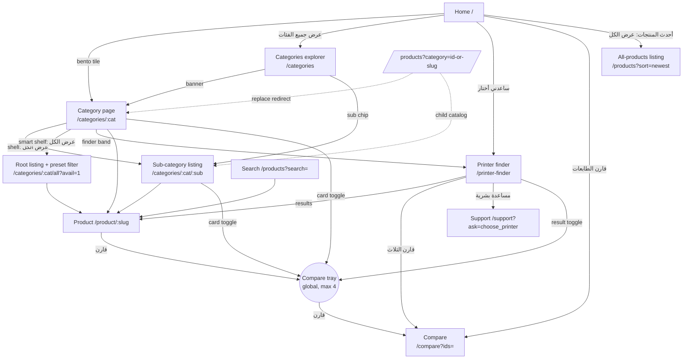
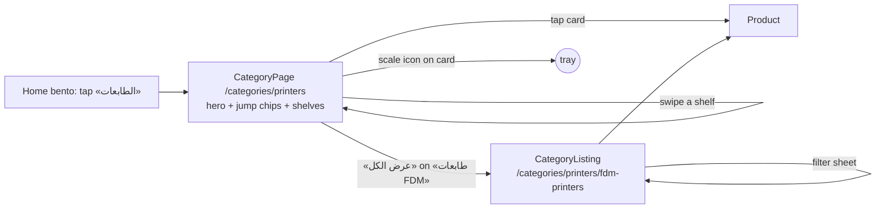
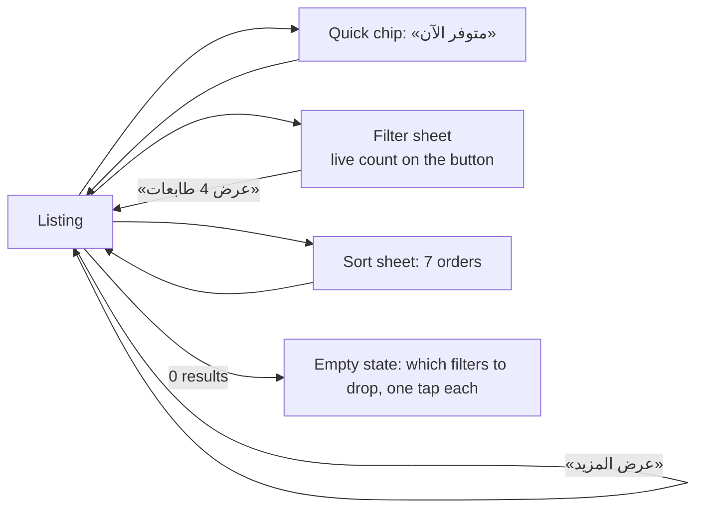
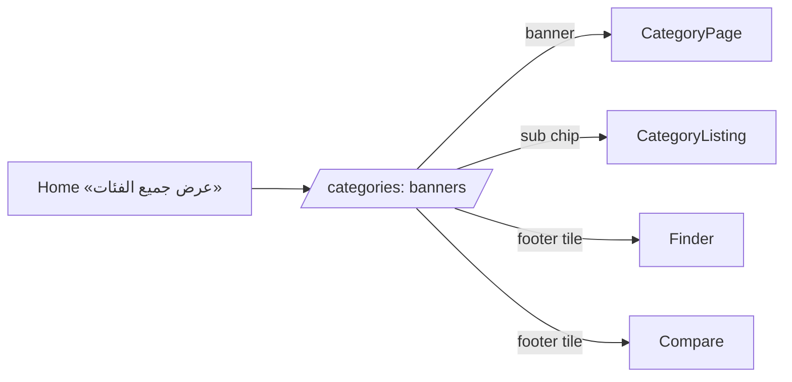
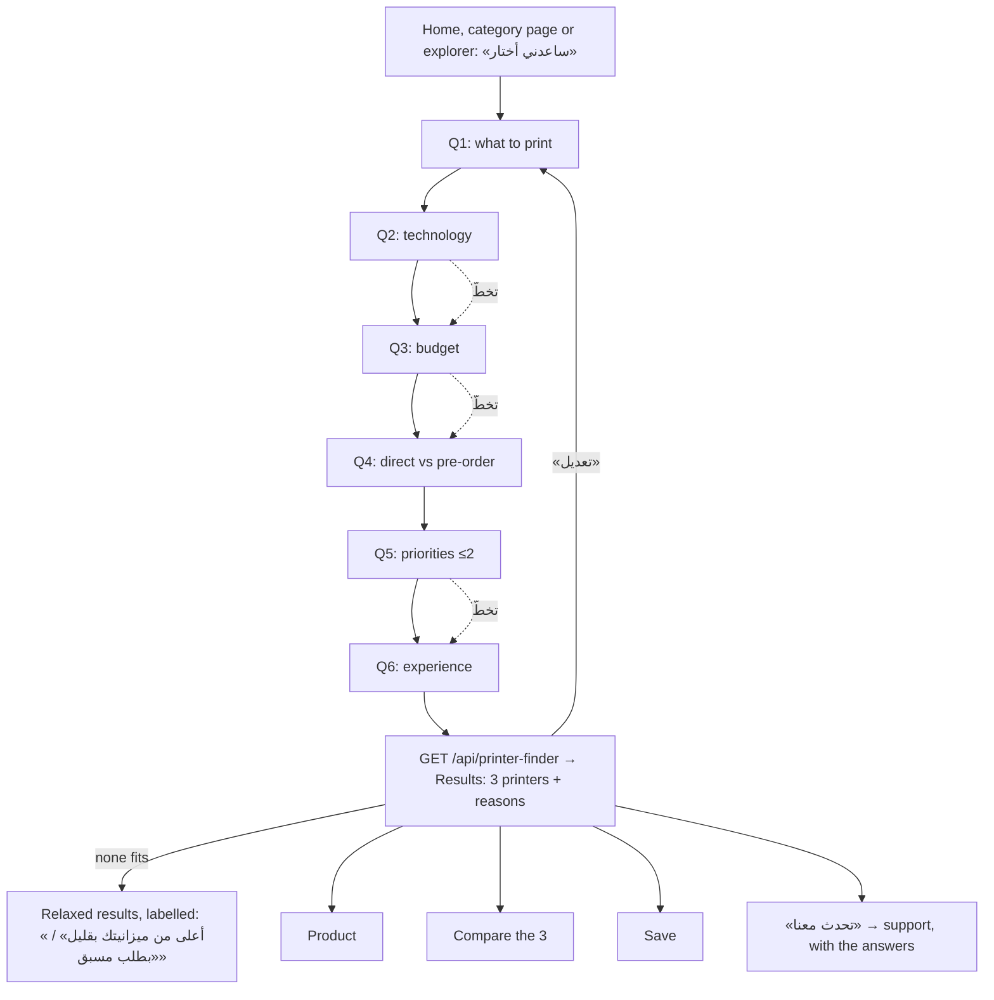
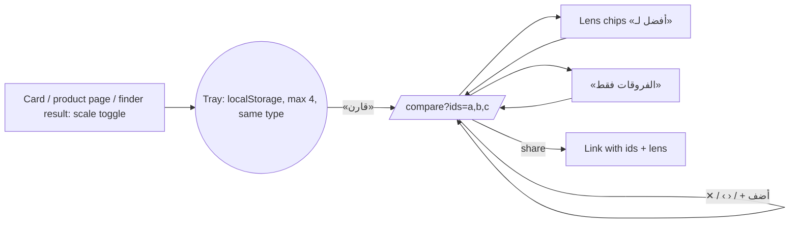

# Catalog discovery: categories, listings, printer finder, and compare

**Status:** design proposal, 2026-09-25. Nothing here is built yet. The build order is in [IMPLEMENTATION_PLAN.md](./IMPLEMENTATION_PLAN.md).
**Scope:** the owner's brief. It covers the compact product card, the category gateway, the specialised listing, the all-categories explorer, the guided printer finder, and the compare system.
**Data source:** the live catalogue (GET `/api/home`, `/api/products`, `/api/compare` on levonis-iq.com, read on 2026-09-25) and the code on `main` (b4c98a5).
**Theme:** the mockups use the **light** tokens from `src/index.css` (THEME TOKENS, light). Every spec below names semantic tokens only (`bg-canvas`, `bg-surface`, `text-text-*`, `border-border-subtle`, `text-gold`, `bg-charcoal` for deliberately dark bands). That way the dark theme needs no extra work. This is a hard rule while the theme migration is in flight.

Mockups (390 px, 2×, real products and photographs): [`mockups/`](./mockups). The HTML sources are in [`mockups/src/`](./mockups/src).

| # | Screen | File |
|---|---|---|
| 1 | Compact product card: home rail, 2-column grid, card anatomy | `mockups/01-product-card-grid.png` |
| 2 | Category page: printers | `mockups/02-category-printers.png` |
| 3a | Sub-category listing (FDM printers) with the compare tray | `mockups/03a-listing-fdm-tray.png` |
| 3b | The same listing with the filter sheet open | `mockups/03b-listing-filter-sheet.png` |
| 4 | All-categories explorer | `mockups/04-categories-explorer.png` |
| 5 | Printer finder, question 1 | `mockups/05-finder-step1.png` |
| 6 | Printer finder, question 5 (priorities, multi-select) | `mockups/06-finder-step5.png` |
| 7 | Printer finder results | `mockups/07-finder-results.png` |
| 8 | Compare page with the «أفضل لـ» lenses | `mockups/08-compare.png` |

---

## 0. What is wrong today (from the owner's screenshots and the code)

| Where | What the customer meets | Cause |
|---|---|---|
| Product card (home rail, `/products`) | A tall card: 274 to 298 px at 174 px wide. The name is at 14 px. Two member-price teaser lines. Availability is an **8 px** strip at the bottom edge (`DirectStockEdge`) that nobody can read on a phone. | `ProductCard.tsx` and the inline card in `Products.tsx` are two copies of one design. `CardPrice` always prints PRIME and PRO. |
| «تسوق حسب الفئة» tiles | Every tile opens `/products?category=<id>`, a flat grid with a name, no description, no sub-sections, no filter or sort. | There is no category page. `/api/products` accepts only `search`, `category`, `type`, `limit`, `offset`. |
| «عرض جميع الفئات» | Opens `/products`, which is **all products**, not categories. | `CategoryBento` → `SectionHead to="/products"`. |
| «ساعدني أختار» | Opens the support assistant, which lists 5 printers with prices and asks nothing. | `handleChoosePrinter` in `worker/routes/support.ts` (a deliberate refusal to "invent a judgement"). |
| «قارن الطابعات» | Opens `/compare` with an empty picker. Nothing on a card or listing can add to a comparison, and there is no tray. | Only the product page sends `?ids=<one>`. |
| Sale type on a card | A card cannot say «طلب مسبق», because the listing never tells it. | `CARD_FIELDS` omits `sale_types` / `selling_type`. |

**Data findings that affect the design:** the catalogue today has 14 products in 4 roots. Printers has 10 products and one non-empty child (FDM). There are no Resin printers. Laser machines are a separate root (`cat_laser`), and laser appears only as a **printer option** («Laser Full Combo» on H2D/H2S/H2C).
- `noise_level` is missing on 5 of 10 printers. `skill_level` is missing on the A1 and the U1.
- The compare engine prints `release_year` with a thousands separator («2,025»). This is a bug to fix in stream S7.
- `build_volume` on the multi-nozzle machines (X2D, H2D, H2C) is free text, so it is not scored.
- Product names carry the whole option list («Bambu Lab H2D / H2D Combo / Laser Full Combo 10W / …»).

The design must look right with 14 products and still work with 1,400.

---

## 1. Principles

1. **One card, everywhere.** A single `ProductCard` with a `compact` density replaces the two copies. It is used on home, category shelves, listings, search and saved items.
2. **Direct sale first, honestly.** Items available for direct sale lead every default ordering (a stable partition, as `orderLatest` already does). Every card says its availability in words and colour, never colour alone. A pre-order product is labelled, not hidden.
3. **Say only what the data says.** The finder and the compare lenses cite a structured spec value for every claim they make. A missing value is «غير مذكور». It is never a loss, and never a reason. This is the house rule already stated in `worker/lib/compareSpecs.ts` (D1) and `handleChoosePrinter`.
4. **The taxonomy is the map.** Category pages, sub-sections, chips and counts come from the live `catalogs` tree. A section with no products is never drawn, and a smart shelf appears only when it has at least 3 items.
5. **URLs are state.** Filters, sort, finder answers and compare ids all live in the query string. Back undoes the last change, and every screen can be shared.
6. **Calm density.** Mobile gutter 16 px, 8 px grid, one accent (gold) used only for the primary finder CTA and the «الأنسب لك» badge. Selection uses one cue: ink border plus a check, never a gold outline.
7. **Additive, reversible migration.** Old links keep working. `/products?category=` resolves to its category page, and `/support?ask=choose_printer` still answers.

---

## 2. Information architecture



### Routes

| Route | Page (new unless noted) | Notes |
|---|---|---|
| `/categories` | `CategoriesExplorer` | All active roots that have products, plus their non-empty children. |
| `/categories/:categorySlug` | `CategoryPage` | A root, **or** any catalog that has non-empty children. A leaf slug redirects to the listing (below). |
| `/categories/:categorySlug/:subCategorySlug` | `CategoryListing` | `:sub` is a descendant's slug. The reserved segment `all` means "the whole of `:cat`". |
| `/printer-finder` | `PrinterFinder` | Answers in the query string (`?use=&tech=&budget=&sale=&prio=&level=`). With all six present, it opens on the results. |
| `/compare` | `Compare` (existing) | Unchanged contract (`?ids=a,b,c`, max 4, option slots). New optional `?lens=business`. |
| `/products` | `Products` (existing) → renders `CatalogListing` | `?search=` keeps search ranking. No params gives «كل المنتجات». **`?category=` resolves, then `navigate(replace)`** to the canonical `/categories/...` URL (the API response now carries the path). An unknown or legacy free-text token keeps listing exactly as today (see `tests/homeCategories.test.ts`). |
| `/used-printers`, `/bundles` | existing | Linked from the explorer only when they have stock. |

**Why nested slugs rather than ids:** `catalogs.slug` is `UNIQUE`, human-readable and already accepted by `/api/products?category=`. Nesting reads well in a shared link, and the server resolves by the last segment. A path whose parent does not match gets a canonical redirect, never a 404. Slug renames in the admin should keep the old slug in a `catalog_slug_history` table so links survive. This is optional and listed as an owner question.

The admin taxonomy editor must reject the slug `all` (a one-line validator addition).

---

## 3. The five journeys

### 3.1 Browse by category (home → category → sub-section → product)


Prefetch: on `pointerdown` or `focus` of a bento tile, `import()` the CategoryPage chunk and warm `GET /api/catalog/printers` into `pageCache`.

### 3.2 Specialised listing



### 3.3 All categories



### 3.4 Printer finder


Each answer does `history.replaceState` on the query string, so a refresh never loses progress. "Back" goes to the previous question, not the previous page. The close button (✕) returns to where the finder was opened.

### 3.5 Compare



---

## 4. The product card (compact density)

Mockup 1 shows the home rail, the grid, the anatomy, and before/after.

### 4.1 Geometry (390 px phone)

| Context | Card width | Grid |
|---|---|---|
| Listing grid | `(390 − 2×16 − 10) / 2 = 174` px | 2 columns, gap 10, gutter 16. 3 columns from 640 px, 4 from 1024, 5 from 1280 |
| Home and category shelves (rails) | 148 px fixed (2.45 cards visible, which invites a swipe) | `snap-x`, gap 10 |

| Part | Spec |
|---|---|
| Card | `bg-surface`, 1 px `border-border-subtle`, radius 14, `overflow:hidden`. Height 262 px at 174 wide (fixed by the fixed name box), down from 274 to 298. |
| Media | `aspect-ratio: 6/5` (174×145) on `bg-charcoal`. `object-fit: cover; object-position: 50% 4%`. The shop's studio photographs letter the model name in the top fifth and the shop address in the bottom sixth, so a 6:5 box anchored to the top keeps the machine and its lettered name whole and drops only the address line. No hover zoom on touch. |
| Compare toggle | Top inline-start. 30 px visual, 44 px hit (`.lv-hit`). `bg-[rgb(14_16_19/.52)]` with blur and an ivory icon. When on, an ivory fill, ink icon, and the scale icon swaps to a ✓. `aria-pressed`, label «أضف X إلى المقارنة» / «أزل X من المقارنة». **Shown only for comparable types** (`compare_type` ∈ printer, laser, filament) and only where `compareToggle` is true (listings, category shelves, finder, home «أحدث المنتجات»). |
| Offer badge | Top inline-end: the existing `OfferBadge` «SALE», 18 px tall. A scheduled-offer countdown stays at bottom-start, unchanged. |
| Body | Padding 9 / 10 / 10. |
| Name | 12.5/17, weight 600, `line-clamp-2`, `min-height: 34px`, `dir="ltr"`, `text-align: right` (the product name is English by house rule §3/§12, aligned to the Arabic column edge). Uses `card_name` when the admin set one (owner question Q2). |
| Price | «يبدأ من» 10 px `text-text-muted` only when `display_from`. Amount 15/20, weight 800, tabular numerals. «د.ع» 10.5 px `text-text-secondary`. For a member, the main price colour follows `CardPrice` (PRO red, PRIME and PLUS gold). |
| Member line | **One** line, 10.5/15: sparkle icon + `674,100` + «لأعضاء» + **PRO** (in PRO's red), for the cheapest member rung that is below what this viewer pays. Hidden for a viewer already on that rung. Compact mode never shows both PRIME and PRO. |
| Availability | Pinned to the bottom (`margin-top:auto`), 11/15, weight 700, dot plus word. **«متوفر الآن»** in `text-success` with a 6 px filled dot and a 3 px halo. The quantity sits at the inline-end in 10.5 muted: «5 قطع», or «بقي 2» in `text-warning` when ≤ 2 (the shop's low-stock threshold, when set, replaces 2). **«طلب مسبق»** in `text-warning` with a hollow dot. **«غير متوفر»** in muted with a grey dot. It replaces `DirectStockEdge` inside compact cards. |
| Hidden in compact | Second member teaser, brand line (the name already starts with the brand), any description. |

States: skeleton (`ProductCardSkeleton` gets a `compact` shape with the same 262 px, so there is no layout shift), missing image (`SafeImage` monogram on charcoal), locked bundle card (unchanged `compositionCard`), and graded/used (a small «مستعمل» chip under the name, from `condition`).

Accessibility: the whole card is one link. The compare toggle is a sibling `button` positioned over the media, **not nested in the anchor**. The card is a `div` wrapper holding a stretched `a` and the button. The availability is inside the link text (for example «متوفر الآن، 5 قطع»), so a screen reader hears it.

### 4.2 Visual priority for direct sale

1. Ordering: every default sort partitions available-now items first (stable), then pre-order.
2. On listings, a quiet divider row «بطلب مسبق» separates the two groups when the sort is the default «الأنسب» (mockup 3a).
3. The availability line is the only coloured text on the card besides a member price. Green reads as "yours today". There is no extra badge.

---

## 5. Categories explorer: `/categories`

**Purpose:** a real map of the shop. It should make choosing a category feel like choosing a department in a good store. **Mockup 4.**

**Sections, top to bottom**
1. Top bar: back and search (the search opens `LiveSearch` in an overlay).
2. Title «كل الفئات» (27/38, 800). Sub-line from data: «أربع فئات و14 منتجًا. اختر فئة لتتصفح أقسامها.» (counts are live; with more than 10 categories it drops the numbers: «اختر فئة لتتصفح أقسامها.»)
3. **Category banners**, one per root in `sort` order:
   - **Lead banner** (the root with `is_printer_catalog` or the most products): 208 px tall. Every other banner is 150 px. Radius 20, `bg-charcoal`, `data-theme="dark"`.
   - Content at inline-start (60% width): name (19/27, 800; lead 23/32), description (12/18, ivory 72%, 2 lines max), then pills at the bottom: «10 طابعات» and «● 4 متوفرة الآن». The second pill is omitted when 0.
   - Photograph at inline-end, 54% width. It uses the admin's `hero_image` if set, else `image_url`, else a representative product photo (same rule as `representative()`, available first, no repeats across banners). It is cropped to the product band (`scale 1.45`, lead `1.75`, centre 57%) and fades toward the text (`lv-fade-start`).
   - A 40 px gold arrow button at the inline-end corner (decorative; the whole banner is one link).
4. Under a banner, a **sub-category chip row** («طابعات FDM 10») links straight to the listing. It is drawn only when the root has at least one non-empty child, and it scrolls horizontally when there are more than 3.
5. Extra entries, only when they have stock: «المنتجات المستعملة» (`/used-printers`) and «الباقات» (`/bundles`), as regular banners.
6. Footer tiles: «ساعدني أختار طابعة / ستة أسئلة ونرشّح لك ثلاثًا.» and «قارن الطابعات / حتى أربع طابعات جنبًا إلى جنب.»

**Component tree**
```
CategoriesExplorer (page, lazy)
├─ PageTopBar
├─ PageTitle
├─ CategoryBanner ×n          (props: node, variant: 'lead'|'regular', image)
│   └─ PromoPhoto (existing, crop mode)
├─ SubCategoryChips ×n
└─ DiscoveryFooterTiles        (finder + compare)
```

**States:** loading shows banner skeletons (208, 150, 150) with no shimmer under reduced motion. Error shows `ErrorState` with retry. Empty (no roots with products) shows «لا توجد فئات بعد» with a link to «كل المنتجات». Offline shows the last `pageCache` snapshot with a top note «تعرض آخر نسخة محفوظة».

**Desktop:** a max-width 1200 container, banners in a 2-column grid (lead spans both columns at 280 px), and sub-chips inside the banner footer.

**Data:** `GET /api/catalog/tree` (section 11).

---

## 6. Category page: `/categories/:categorySlug`

**Purpose:** explore a department. It should be richer than a list and faster than a search. **Mockup 2.**

**Sections, top to bottom**
1. **Top bar** (56, translucent `bg-canvas/88` with blur): back, an empty title that fades in with the category name after the hero scrolls away, search, and a compare icon with a count badge (when the tray has items).
2. **Hero** (radius 22, `bg-charcoal`, `data-theme="dark"`, min 252 px):
   - Breadcrumb «الفئات › الطابعات» (11.5, ivory 60%). «الفئات» links to `/categories`.
   - `h1` name (24/33, 800).
   - Description (12.5/20, ivory 74%, max 3 lines) from the new `catalogs.description_*`. If empty, the line is omitted, never invented.
   - Stats (live): «10 طابعات» and «● 4 متوفرة الآن» (drawn only when > 0).
   - CTAs, printers only (`is_printer_catalog`): **«ساعدني أختار»** (gold fill, wand icon, → `/printer-finder`) and **«قارن الطابعات»** (ghost-on-dark, → `/compare`, prefilled from the tray if it has printers). For other categories, one ghost CTA **«تصفّح الكل»** → `/categories/:cat/all`.
   - Photograph in the bottom inline-end quadrant (54%×74%), masked left and top. The source is `hero_image`, else a representative available product.
3. **Jump chips** (sticky under the top bar): one per shelf that follows, with counts. The first is selected and it scroll-spies. Drawn only when there are ≥ 2 shelves.
4. **Shelves**, in this order:
   1. **One per non-empty child catalog** (in `sort` order): title «طابعات FDM» plus a count, the child's description (1 line), «عرض الكل» → `/categories/printers/fdm-printers`, and a rail of up to 10 compact cards, available first.
   2. **Smart shelves**, each only if it has ≥ 3 items and is not identical to a child shelf:
      - «جاهزة للتسليم الآن»: `direct_stock_available > 0`. Sub-line «بيع مباشر من مخزون ليفونيس في العراق.» → `…/all?avail=1`.
      - Printers only, «للطباعة بأكثر من لون»: `max_colors ≥ 16`. Sub-line «16 لونًا فأكثر في الطبعة الواحدة، حسب ورقة مواصفات كل طابعة.» → `…/all?colors=16-`.
      - Filament only, «حسب المادة»: chips per `material_type` value (PLA, PETG…) → listing filtered.
   3. **«حسب العلامة التجارية»**: 2-column brand tiles (name plus «9 طابعات») when ≥ 2 brands → `…/all?brand=<slug>`.
5. **Finder band** (printers only): «لست متأكدًا أيها يناسبك؟ / ستة أسئلة قصيرة، ونرشّح لك أفضل ثلاث طابعات مع السبب.» → `/printer-finder`.
6. **«يكمّل طابعتك»** (printers only; for filament use «تحتاجها مع الخيوط»): 3 mini tiles for sibling roots (materials, printer accessories, maker supply), from the tree. These are links, not products.

**A category with no sub-sections** (for example «مواد الطباعة», which today has one child with one product) never shows an empty frame:
- 0 or 1 non-empty children **and** fewer than 8 products: the page **is the listing**. `/categories/printing-materials` renders `CategoryListing` for `all`, with the hero on top (compact, 180 px) instead of shelves.
- 1 child and ≥ 8 products: one child shelf plus smart shelves (this is the printers case today).
- ≥ 2 children: child shelves first, then smart shelves.
- Never: a shelf for Resin or Laser when they have no products. They appear by themselves the day the admin files a product under `cat_printers_resin` or the laser root. Laser machines are a root of their own, so the printers page links to it in «يكمّل طابعتك» when it has products.

**Component tree**
```
CategoryPage (lazy)
├─ PageTopBar (scroll-linked title, CompareBadge)
├─ CategoryHero
│   ├─ Breadcrumbs
│   ├─ CategoryStats
│   └─ HeroCtas (finder/compare | browse all)
├─ ShelfJumpChips (sticky, scroll-spy via IntersectionObserver)
├─ ProductShelf ×n   (title, count, description, seeAllTo, products[], compareToggle)
│   └─ ProductCard density="compact" width=148
├─ BrandShelf
├─ FinderBand
└─ RelatedCategories
```

**States:** skeleton hero plus 2 shelf skeletons. For an unknown slug, a 404 panel «هذه الفئة غير موجودة» with «كل الفئات». For an inactive catalog that still has products, render it (matching `catalogSubtreeFilter`). A shelf request that fails is not per-shelf, because the page is one request (section 11), so the whole page shows `ErrorState` unless a snapshot exists.

**Desktop:** the hero is a 2-column split (text 5fr, photo 7fr, 320 px). Shelves become 5-column grids (the first 5 items) with «عرض الكل». The jump chips become an inline tab row.

---

## 7. Sub-category listing: `/categories/:cat/:sub`

**Purpose:** find the one product. Everything here is one thumb away. **Mockups 3a and 3b.**

**Sections**
1. **Top bar:** back, title «طابعات FDM» plus a sub-line «10 طابعات» (live count after filters: «4 من 10»), share.
2. Description (12.5/19, muted, ≤ 2 lines) from the catalog.
3. **Scoped search field:** «ابحث في طابعات FDM». It filters inside this section (`search` + `category` together, which the API already supports). It uses `LiveSearch size="compact"` with suggestions limited to the section.
4. **Toolbar** (sticky under the top bar, 38 px controls):
   - **«التصفية»** with a count badge of active filters. It opens the filter sheet.
   - **«الترتيب: الأنسب»**. It opens the sort sheet.
   - A grid or list view toggle (list = 96 px image rows for comparing prices at a glance; the choice is remembered in `localStorage`).
5. **Quick chips** (one tap, toggle): the most useful facets for this section type.
   - Printers: «متوفر الآن», «طلب مسبق», «هيكل مغلق», «متعدد الألوان», and the top brand.
   - Filament: «متوفر الآن», PLA, PETG, «1.75 مم».
   - Default: «متوفر الآن», «عليها عرض», and the top brand.
6. **Applied filters row** (when any are active): removable chips «متوفر الآن ✕», «Bambu Lab ✕», and «مسح الكل».
7. **Result line:** «10 طابعات» at the start and the sort explanation at the end («المتوفر للبيع المباشر أولًا»). It is announced via `aria-live="polite"`.
8. **Grid** of compact cards, with the «بطلب مسبق» divider under the default sort.
9. **«عرض المزيد»** (24 per page; the button pattern already in `Products.tsx`). It is a button, not infinite scroll, so the footer stays reachable and position survives back navigation.
10. **Compare tray** floats above the bottom nav when it has items (section 10.4).

**Filter sheet** (`Sheet`, detent `large`, mockup 3b). The header is ✕ | «التصفية» | «مسح الكل». Sections are separated by hairlines, and each is drawn only if the facet has ≥ 2 distinct values in the current section:

| Section | Control | Facet source |
|---|---|---|
| التوفر ونوع البيع | Switch «المتوفر الآن فقط / بيع مباشر من مخزون العراق» plus a segmented «الكل · بيع مباشر · طلب مسبق» | `direct_stock_available`, `sale_types` |
| السعر (د.ع) | Histogram (thin bars, the selected range in ink) plus a two-knob slider (RTL: low at the right) plus «من / إلى» numeric inputs (`inputmode="numeric"`, grouped digits) | the viewer's resolved `display_price_iqd` |
| العلامة التجارية | Checkbox rows with counts | `brand_id` → brand names from `/api/home` brands |
| العروض والعضوية | «عليها عرض» (scheduled offer or SALE). «سعر أقل لأعضاء PRIME / PRO» only if it discriminates (count < total). | `offer`, `display_*` |
| Section-specific, printers | «التقنية» (FDM / Resin, only if both exist), «عدد الألوان» (4 · 16–20 · 24 فأكثر, buckets from data), «حجم الطباعة» (مدمج ≤ 180 · قياسي 256–270 · كبير ≥ 300, on the longest axis), «الهيكل» (مغلق / مفتوح), «مستوى الخبرة» | `spec_fields`: `technology`, `max_colors`, `build_volume`, `enclosed`, `skill_level` |
| Section-specific, filament | «المادة» (`material_type`), «القطر» (`diameter`), «اللون» (swatches from `colors[]`/`color_hex`), «الوزن» (`net_weight`) | `spec_fields`, `colors` |

- Counts are **disjunctive**: each facet's counts ignore that facet's own selection, so you can see what you would get by switching. An option with a 0 count is shown dimmed and `aria-disabled`, never hidden (the options stay stable while tapping).
- The footer (sticky, safe-area padded) has «مسح» (ghost, 96 px) and **«عرض 4 طابعات»** (primary, live count, Arabic dual and plural forms: «عرض طابعة واحدة», «عرض طابعتين», «عرض 4 طابعات»). Changes apply on that tap, not live behind the scrim. This is cheaper, and the grid does not jump under the sheet.
- The count comes from the facets endpoint with the draft state (debounced 200 ms, abortable).

**Sort sheet** (detent `medium`, a radio list with a check):
«الأنسب» (default: available-now first, then shelf order `display_order`), «الأحدث», «السعر: من الأقل», «السعر: من الأعلى», «الاسم (A–Z)», «المتوفر أولًا» (available-now first, then by stock count descending), «البيع المباشر أولًا» (products whose sale types include direct sale, then pre-order-only).

**Empty result:** «لا توجد طابعات بهذه الشروط», then one line per active filter with its own «أزل» and the count it would bring back («أزل "24 لونًا فأكثر" ← 4 طابعات»), plus «مسح الكل».

**URL** (`replace` on each change, `push` only on section change):
`/categories/printers/fdm-printers?sort=price_asc&avail=1&sale=direct&price=500000-2500000&brand=bambu-lab,snapmaker&colors=24-&size=large&enclosed=1&level=beginner&q=h2`

**Component tree**
```
CategoryListing (lazy; also rendered by Products for search/all)
├─ PageTopBar (title, live count, share)
├─ ListingIntro (description)
├─ ScopedSearch (LiveSearch compact)
├─ ListingToolbar (sticky)
│   ├─ FilterButton (badge)  → FilterSheet
│   ├─ SortButton            → SortSheet
│   └─ ViewToggle (Segmented size="sm")
├─ QuickFilterChips
├─ AppliedFilterChips
├─ ResultCount (aria-live)
├─ ProductGrid | ProductList
│   └─ ProductCard density="compact"
├─ LoadMore
└─ EmptyFiltered (per-filter undo)
FilterSheet
├─ FacetSection ×n: AvailabilityFacet, PriceFacet (PriceHistogram, RangeSlider, PriceInputs),
│  CheckboxFacet, ChipFacet, SwatchFacet
└─ SheetFooter (clear, apply with live count)
lib: src/lib/catalog/listingQuery.ts (parse/serialize URL ⇄ state, pure, tested)
```

**Desktop (≥ 1024):** the filters become a sticky side column (264 px) at inline-start with the same sections expanded, and the grid has 4 columns. The toolbar keeps sort, view and count, and applied chips sit above the grid. The sheet is not used.

---

## 8. Printer finder: `/printer-finder`

**Purpose:** a confident shortlist in under a minute, with the reason for each pick. **Mockups 5, 6 and 7.**

**Chrome:** a focused full-screen flow with the bottom nav hidden. Top: ✕ (back to origin; it asks «الخروج من المرشد؟» only after ≥ 3 answers), «السؤال 2 من 6» (`aria-live`), and «تخطَّ» on skippable steps (2, 3 and 5). A 6-segment progress bar (`role="progressbar"`) fills right-to-left. The sticky footer has «رجوع» (ghost, 104 px) and «التالي» (primary). Single-choice steps **auto-advance 220 ms** after a tap, and the button is still there for keyboard and screen-reader users. Transitions are a 180 ms horizontal slide in the reading direction, or a cross-fade under reduced motion.

Answered steps show as small chips above the question (mockup 6). Tapping one jumps back to that question.

| # | Question (Arabic copy) | Options (value) | Type | Skip |
|---|---|---|---|---|
| 1 | **ماذا تريد أن تطبع؟**<br/>اختر الأقرب لما تريده. يمكنك تغيير الإجابة في أي وقت. | هواية واستخدام شخصي / هدايا ومجسمات وأغراض للبيت (`hobby`) · مشروع تجاري / طباعة يومية ولساعات طويلة (`business`) · مجسمات وشخصيات / تفاصيل دقيقة وأسطح ناعمة (`figures`) · قطع عملية وهندسية / قطع متينة تتحمل الحرارة (`functional`) · منتجات للبيع / كميات بجودة ثابتة (`sell`) · طباعة متعددة الألوان / أكثر من لون في القطعة نفسها (`multicolor`) · لا أعرف بعد / سنقترح خيارات متوازنة تناسب أغلب الناس (`unsure`) | single, 2-col tiles + 1 wide | no |
| 2 | **أي تقنية تفضّل؟**<br/>إن لم تكن متأكدًا اختر «لا أعرف». | لا أعرف (`any`) · Filament: خيوط بلاستيك، الأكثر استعمالًا ومتانة (`fdm`) · Resin: تفاصيل دقيقة جدًا للمجسمات الصغيرة (`resin`) · Laser: حفر وقص على الخشب والجلد (`laser`) | single, list rows | yes |
| 3 | **ما ميزانيتك؟**<br/>الأسعار تبدأ من سعر النسخة الأساسية. | أقل من 750 ألف (`0-750000`) · 750 ألف – 1.25 مليون · 1.25 – 2.5 مليون · أكثر من 2.5 مليون · لا يهم (`any`). Each option shows the live count «4 طابعات». | single | yes |
| 4 | **متى تريدها؟** | أريدها الآن: بيع مباشر فقط (`direct`) · لا مانع من الطلب المسبق (`any`) | single | no |
| 5 | **ما الأهم لك؟**<br/>اختر أمرين على الأكثر، بالترتيب. الأول يُحسب أكثر. | الجودة والدقة (`quality`) · السرعة (`speed`) · الهدوء (`quiet`) · تعدد الألوان (`colors`) · سهولة الاستخدام (`ease`) · حجم الطباعة (`size`) | multi ≤ 2, ordered (1, 2 badges). A third tap shows «اخترت أمرين. ألغِ أحدهما لتختار غيره.» | yes |
| 6 | **ما خبرتك في الطباعة ثلاثية الأبعاد؟** | مبتدئ: أول طابعة لي (`beginner`) · متوسط: طبعت من قبل (`intermediate`) · محترف: أعرف الإعدادات جيدًا (`pro`) | single | no |

**Options that the shop cannot serve are shown honestly, not hidden.** With 0 Resin printers, «Resin» is dimmed with «لا توجد طابعات Resin في المتجر حاليًا — اسألنا عن الطلب المسبق». Picking it anyway gives a results page with a support CTA first. «Laser» maps to printers that have a laser module (needs the admin tag, Q3) plus the laser root when it has products.

**Results** (mockup 7):
- «أفضل 3 طابعات لك» (or «أفضل طابعتين لك» or «أنسب طابعة لك»).
- The honesty line: «رتّبناها من ورقة مواصفات كل طابعة وسعرها الحالي وتوفرها، ولم نفترض أي رقم غير مكتوب.»
- Answer chips plus «تعديل».
- **#1 card:** a 16:10 photo, the «الأنسب لك» gold badge, name, price and availability, then «لماذا نرشّحها» with 3 reasons (✓, green) and at most 1 «انتبه» caveat (ⓘ, amber). Actions: **«عرض المنتج»** (primary), a compare toggle, and save (heart; for a guest this calls `useSignInPrompt` and remembers the product for after sign-in).
- **#2 and #3:** horizontal cards (92 px photo with a rank badge), 1 reason and 1 caveat each, «عرض المنتج» and the compare toggle.
- «قارن الطابعات الثلاث» → `/compare?ids=…` (and it fills the tray).
- The exclusion disclosure, collapsed: «7 طابعات أخرى: 6 خارج ميزانيتك، و Snapmaker U1 رابعة لأنها تطبع 4 ألوان فقط». It expands to a list with the reason for each.
- Human-help band (charcoal): «هل تريد مساعدة بشرية؟ / نرسل إجاباتك لفريق ليفونيس ويكمل معك من حيث توقفت.» plus **«تحدث معنا»**. This goes to `/support?ask=choose_printer&finder=<encoded answers>`, and the support intake shows the answers as the first message.

The scoring model is in section 9.

**States:** loading results shows 3 skeleton cards and «نبحث في 10 طابعات…». No candidates at all (a Resin-only answer) shows the support-first panel. Error shows `ErrorState` with retry, and the answers are kept. Offline shows «النتائج تحتاج اتصالًا — إجاباتك محفوظة».

**Component tree**
```
PrinterFinder (lazy)
├─ FinderChrome (close, step label, skip, FinderProgress)
├─ AnsweredChips
├─ FinderStep (question, helper, options)
│   ├─ ChoiceTiles (radiogroup) | ChoiceRows (radiogroup | ordered multi)
│   └─ BudgetOptions (live counts from /api/printer-finder/meta)
├─ FinderFooter (back, next)
└─ FinderResults
    ├─ ResultHero (rank 1)  → ReasonList, CaveatLine, ResultActions
    ├─ ResultRow ×2
    ├─ CompareAllButton
    ├─ ExclusionDisclosure
    └─ HumanHelpBand
lib: src/lib/finder/answers.ts (URL ⇄ answers), src/components/finder/strings.ts (reason copy, trilingual)
worker: worker/lib/printerFinder.ts (pure scoring), worker/routes/printerFinder.ts
```

**Desktop:** a centred 640 px column, tiles in 3 columns, and results as #1 on the left with #2 and #3 stacked on the right.

---

## 9. Finder scoring model

### 9.1 Candidates
The same set the support assistant uses: active products with a spec sheet whose `product_type` (from the catalogue branch, via `productTypeForBranch`) is `printer` (or `laser` when tech = laser). The price is the **viewer's resolved `display_price_iqd`** ("from" price). Availability is `direct_stock_available`, and sale types come from `sale_types`.

### 9.2 Hard filters (in order), with transparent relaxation
1. Technology (`technology` field; FDM covers FDM and filament). `any` keeps everything.
2. Budget: `display_price_iqd` within the range.
3. Sale: `direct` keeps `direct_stock_available > 0`.

If fewer than 3 survive, relax **one step at a time** and **label** every relaxed result:
- budget +20% gives «أعلى من ميزانيتك بقليل»;
- then allow pre-order gives «متوفرة بطلب مسبق»;
- then any technology gives «تقنية مختلفة عمّا اخترت».

A relaxed item never outranks a non-relaxed one.

### 9.3 Criteria (0..1 each, min-max normalised **within the candidate set**; all-equal gives 0.5)

| Criterion | Fields (existing `templateFamilies` ids) | Reading |
|---|---|---|
| `speed` | `print_speed` (70%), `max_acceleration` (30%) | higher |
| `colors` | `max_colors` (log2), +0.1 if `extruders ≥ 2` | higher |
| `quality` | `min_layer_height` (lower); resin: `xy_resolution` (lower) | lower |
| `quiet` | `noise_level` dB | lower |
| `ease` | mean of known: `skill_level` {Beginner 1, Intermediate .6, Advanced .3, Professional .15}, `assembly` {Pre-assembled 1, Partially .6, Kit .2}, `auto_leveling`, `filament_sensor`, `power_loss_recovery`, `camera` (Yes 1 / No 0) | higher |
| `size` | `build_volume` longest axis (60%) and volume (40%, log) | higher |
| `durable` | `enclosed`, `chamber_temp_max`, `bed_temp_max`, `supported_filaments` mentions (PA, PC, CF, GF, ABS, ASA; counted with `readList`) | higher |
| `reliability` | `print_failure_detection`, `filament_sensor`, `power_loss_recovery`, `air_filtration ≠ None`, `warranty` | higher |
| `use_fit` | **new admin field** `use_cases` (multi-select: hobby, business, figures, functional, sell, multicolor, education). 1 if it includes the answer, else 0. Absent: not used. | — |

**Missing value rule:** a missing or unparseable value contributes **0**. The denominator still counts its weight, so the result is conservative. The value is never used as a reason, and it produces a coverage caveat when that criterion is one of the user's priorities: «مستوى الضجيج غير مذكور لهذه الطابعة».

### 9.4 Weights
Base weights from Q1 (use):

| use | speed | colors | quality | quiet | ease | size | durable | reliability | use_fit |
|---|---|---|---|---|---|---|---|---|---|
| hobby | 1 | 1 | 1 | 1.5 | 2 | .5 | 0 | 1 | 2 |
| business | 2 | 1 | 1 | 0 | .5 | 1.5 | 1.5 | 2 | 2 |
| figures | 0 | .5 | 3 | .5 | 1 | 0 | 0 | .5 | 2 |
| functional | 1 | 0 | 1 | 0 | .5 | 1 | 3 | 1 | 2 |
| sell | 2 | 1 | 1.5 | 0 | .5 | 1 | 1 | 2 | 2 |
| multicolor | .5 | 3.5 | 1 | .5 | 1 | .5 | 0 | 1 | 2 |
| unsure | 1 | 1 | 1 | 1 | 1.5 | 1 | .5 | 1 | 0 |

Then:
- **Priorities (Q5):** first choice +3, second choice +2 on that criterion.
- **Experience (Q6):**
  - beginner: `ease` +2, and × 0.85 on the total for `skill_level = Professional`;
  - intermediate: `ease` +0.5;
  - pro: `ease` × 0, `speed` +1, `size` +1.

`score = Σ wᶜ·sᶜ / Σ wᶜ`

Then:
- **+0.06** if available now. This is the owner's direct-sale priority (owner question Q7), and it is always stated as a reason when it matters.
- **−0.04 × (price / budget max)**, a value tie-break.

Show the top 3, plus a 4th only if it is within 0.02 of the 3rd.

### 9.5 Reasons and caveats (never free text)
The server returns **codes plus values**, and the client renders copy from `strings.ts`:
- `reasons`: up to 3 of the criteria with the highest `wᶜ·sᶜ` where `sᶜ ≥ 0.6` **and** the field is known. Each carries `{code, field_id, value_text, top: boolean}`. For example, `speed` gives «سرعة طباعة حتى 1,000 mm/s», plus «— الأعلى بين الخيارات» when `top`. The special codes are `in_stock` («متوفرة الآن — بقي 2») and `in_budget` («ضمن ميزانيتك»).
- `caveats`: at most 1. It is the weakest of the user's priorities (`sᶜ ≤ 0.4` or missing), or a relaxation label, or `skill_level = Professional` for a beginner («مصنّفة للمحترفين»).
- `value_text` is `CompareValue.text` from `readCompareValue`. That is the same parser and the same units as the compare page, so the two can never disagree.
- `excluded`: counts by reason (`budget`, `tech`, `sale`, `ranked_lower`), with ids for the disclosure.
- `coverage`: per priority criterion, how many candidates had data. This drives the note «مستوى الضجيج مذكور لـ 5 من 10 طابعات فقط».

### 9.6 What the admin must add (existing fields unless marked new)
- Fill **`noise_level`** on 5 printers (P2S, P1S, H2D, H2C, A1) and **`skill_level`** on the A1 and the U1.
- **New** `use_cases` (multi-select) on the printer group of `templateFamilies.ts`, labelled «مناسبة لـ» with the hint «اختر الاستخدامات التي تنصح بها لهذه الطابعة». This is the only opinion field, and it is the owner's opinion, recorded.
- **New** `has_laser_module` (select Yes/No) on printers, or model laser as an option-level tag (Q3).
- Normalise multi-nozzle `build_volume` to the main-nozzle `W × D × H` and move the rest to a note. The compare engine then scores it too.
- Fix: the compare formatting of `release_year` («2,025» → «2025»). This is a code bug, fixed in stream S7.

---

## 10. Compare system

The existing page is already principled: verdict, one chart, a server-owned price row, groups, «الفروقات فقط», remove, replace and reorder, ids in the URL, option slots, a same-type guard, and a max of 4 (`MAX_COMPARE_IDS`, reasoned in `worker/routes/compare.ts`). The work is to **feed it** (the tray) and **make it decisive** (lenses, visual rows, sticky header). **Mockup 8.**

### 10.1 Rows and "best in row"
- Rows, groups, `better` direction (`higher`, `lower`, `yes`, `none`) and `winners` stay **server-owned** (`compareSpecs.ts`, driven by `TemplateField.compare`). The client adds no rules.
- Ties give several winners. Missing values never lose (D1). Unparseable values are unscored. Price is shown with weight 0; the row still marks the cheapest as «الأقل», as the server's price row already does.
- Visual encoding per `parse`:
  - `number`: a 4 px bar under each cell. The bar length is `value/max` (higher-better) or `min/value` (lower-better). The winner bar is `bg-success`, others `bg-text-secondary`, with rounded ends.
  - `dimensions`: a bar by volume plus a sub-line in litres («37.0 لتر»).
  - `boolean`: a ✓ or — glyph with the word.
  - `text` / `list`: plain text, `line-clamp-3` with «المزيد».
  - Winner cell: value in 800 weight ink plus a 14 px filled check disc.
  - Each row label shows its direction hint: «الأعلى أفضل», «الأقل أفضل», «للمعلومة، لا يُحتسب», or «لا يُحتسب: قيمة غير مذكورة».
- Price cells show the delta against the cheapest («+246,000», LTR-isolated).
- «الفروقات فقط» (on by default when ≥ 3 products) hides rows where every value is identical. Its footer says «أُخفيت 22 مواصفة متطابقة بين الثلاث / إظهار الكل». The number is real for X2D/H2S/P2S today.

### 10.2 «أفضل لـ» lenses (computed server-side, returned as `comparison.lenses`)
| Lens | Basis | Winner rule |
|---|---|---|
| `beginners` «للمبتدئين» | the `ease` formula (9.3) | highest; needs `skill_level` or `assembly` known for ≥ 2 products |
| `business` «للأعمال» | `speed`, `size`, `enclosed`, `print_failure_detection`, `air_filtration`, `warranty` (equal weights over known) | highest |
| `value` «أفضل قيمة» | `verdict.scores[i] / display_price_iqd[i]` | highest; copy «أعلى نقاط المقارنة لكل دينار» |
| `multicolor` «تعدد الألوان» | `max_colors`, tie-break `extruders` | highest |
| `precision` «أعلى دقة» | `min_layer_height` (lower), `z_accuracy`; resin: `xy_resolution` | best |

- A lens has a winner only if the margin is ≥ 5%. Otherwise it shows «متقاربة» (a tie), and with fewer than 2 products having data it shows «لا توجد بيانات كافية».
- Lenses exist for printers and laser machines only. Filament comparisons get no lens row.
- **UI:** a chip row «الكل · للأعمال · للمبتدئين · أفضل قيمة · الألوان · الدقة» and a «الخلاصة: الأفضل لـ» card with one row per lens (the thumbnail and name of the winner, plus a one-line reason built from the same reason codes as the finder).
- Selecting a lens highlights that lens's row in the summary (`bg-ok-soft`) and tints the table rows that feed it (a subtle gold wash at inline-start), and it writes `?lens=business` to the URL.
- For today's X2D / H2S / P2S set, computed from the live data: business → H2S, beginners → P2S, value → X2D, multicolor → X2D, precision → X2D.

### 10.3 Page layout (mobile)
1. Top bar: back, «المقارنة» plus «3 طابعات FDM» (the basis label), share.
2. **Sticky column header:** 3 equal columns (4 scroll horizontally with snap). Each has a 6:5 photo, a 2-line name, price, availability, a ✕ remove (24 px visual, 44 px hit) at the corner, and ‹ › move buttons (reorder, labelled «انقل يمينًا / يسارًا»). Long-press drag reorder also works. After scrolling 120 px it **collapses** to a 56 px strip (a 32 px thumbnail plus a 1-line name), so the table keeps the screen.
3. The lens chips and the «الخلاصة» card.
4. The existing `VerdictBand` and `SpecChart`, collapsed under «التفاصيل الكاملة للنتيجة» to keep the first screen decisive.
5. «المواصفات» plus the «الفروقات فقط» switch, then groups and rows. Row pattern: the label line (12 muted plus the hint), then the cells on one grid row.
6. «أضف طابعة رابعة» (opens the existing `ProductPicker`, same type only).

On desktop, a real `<table>`: a sticky first column of labels (200 px), up to 4 product columns, and the sticky header row.

### 10.4 Compare tray (global)
- **Store:** `src/lib/compareTray.ts`, a tiny external store (`useSyncExternalStore`) persisted in `localStorage` key `lv_compare_v1`: `{v:1, type:'printer', items:[{id, slug, name, image}], at}`. It syncs across tabs with the `storage` event, expires after 30 days, and every read and write is try/caught (private mode gives memory-only).
- **Limits:** 4 items. The 5th tap shows the toast «الحد الأقصى أربع. أزل واحدة أولًا.» and opens the tray.
- **Type lock:** the first item sets `type` (the card's `compare_type`). Adding another type shows a dialog «المقارنة تكون بين منتجات من النوع نفسه. هل تبدأ مقارنة جديدة بـ PLA Matte؟» with «ابدأ من جديد» and «إلغاء».
- **Tray UI** (mockup 3a): a floating bar 12 px from the edges, above the bottom nav (`bottom: var(--nav-stack) + 8px`). It is `bg-surface-raised`, radius 18, `shadow-3`. It holds 40 px thumbnails, a dashed «+» for free slots, the text «طابعتان للمقارنة / يمكنك إضافة طابعتين», **«قارن»** (primary; disabled with 1 item, where it reads «أضف طابعة أخرى»), and ✕ (clear, with a 5 s undo toast).
  - It collapses to a 44 px pill after 4 s without interaction, and a tap expands it again.
  - It is hidden on `/compare`, checkout, cart, the finder, and the admin.
  - On the product page (which has its own sticky purchase bar) it becomes the top-bar compare icon with a badge.
- **Source of truth:** on `/compare` the URL wins, and the page writes its ids back to the tray. Removing a column there removes it from the tray.
- **Entry points:** the card toggle (listings, shelves, home «أحدث المنتجات»); the product page «المقارنة» button (becomes a toggle «أضف للمقارنة» / «في المقارنة ✓» plus a link «قارن الآن (3)»); the finder result toggles and «قارن الطابعات الثلاث»; the category hero «قارن الطابعات» (opens `/compare?ids=` from the tray, or the picker when it is empty).
- Guests can use everything. Nothing is stored server-side.

---

## 11. API changes (minimal, cached, D1-safe)

D1 constraints respected everywhere: **≤ 100 bound parameters** (lists go in one `json_each(?)` parameter, as the search route already does), and **no compound SELECT chains** (no `UNION` ladders; shelves are one query grouped in memory, which stays far under the 5-term limit).

| Change | Where | Shape |
|---|---|---|
| Migration `01xx_catalog_presentation.sql` | `catalogs` | `description_ar/en/ckb TEXT NOT NULL DEFAULT ''`, `hero_image_key TEXT NOT NULL DEFAULT ''`. Admin taxonomy form fields for them. Validator rejects slug `all`. |
| `GET /api/catalog/tree` (new) | `worker/routes/catalog.ts` | Every active catalog with a roll-up `product_count > 0` (reusing `catalogMembership`, **without** the 12/8 cap of `homeCategoryTree`): `{id, slug, parent_id, name_*, description_*, image_url, hero_image_url, product_count, available_count, is_printer_catalog, product_type}`. It is public and viewer-independent: `Cache-Control: public, max-age=60, s-maxage=300` plus the Cache API, and admin taxonomy writes purge it. |
| `GET /api/catalog/:slug` (new) | same | `{node, path:[root…node], children:[…non-empty], shelves:[{id:'child:<id>'|'available'|'multicolor'|'brand', title_key, count, see_all:'/categories/…?…', products:[card…≤10]}], brands:[{id, slug, name, count}], related:[root…]}`. **One** `SELECT * FROM products WHERE status='active' AND composition='' AND <subtree>` (cap 200), then the existing batched pricing, relations and offers, grouped in memory. Cards are tier-priced, so responses are cached only for signed-out viewers (Cache API, 60 s, keyed by URL). |
| `/api/products` new params | `productRoutes.get('/')` | `sort` ∈ `relevance`, `newest`, `price_asc`, `price_desc`, `name`, `available`, `direct`; `avail=1`; `sale=direct\|preorder`; `price=min-max`; `brand=slug,slug` (one `json_each` param); `offer=1`; `member=1`; `f.<field_id>=<value or range>` for whitelisted facet fields (`technology`, `max_colors`, `build_volume`, `enclosed`, `skill_level`, `material_type`, `diameter`, `color_name`); `facets=1` to include facet counts. SQL narrows by category, search, brand and sale type; price, availability and spec facets are applied **after** price resolution in memory over a capped candidate set (300, reporting `truncated:true` above it). Sorting on resolved price happens there too, then `offset/limit`. The unfiltered path keeps today's SQL `ORDER BY` and paging, so there is no regression. |
| Card fields | `CARD_FIELDS` | Add `sale_types`, `created_at`, `compare_type` (from `productTypeForBranch` with the catalogs map, loaded once per isolate and memoised), and `card_name` (new column, optional). |
| `category` echo | `/api/products` | `ResolvedCategory` gains `path: string` (`/categories/printers/fdm-printers`), so the old `?category=` link can `replace` to it. |
| `GET /api/printer-finder` (new) | `worker/routes/printerFinder.ts` + `worker/lib/printerFinder.ts` | `?use&tech&budget&sale&prio&level` → `{results:[{card, rank, score, relaxed?, reasons[], caveats[]}], excluded:{…}, coverage:{…}}`. A pure scorer reusing `readCompareValue`. Rate-limited like `/api/compare`. Signed-out cache 60 s. |
| `GET /api/printer-finder/meta` (new) | same | `{techs:{fdm:10,resin:0,laser:0}, budgets:[{range,count}], total}`, viewer-independent (regular prices), `s-maxage=300`. It drives the counts on questions 2 and 3. |
| `comparison.lenses` | `compareSpecs.ts` / `worker/lib/compareLenses.ts` | `[{id, winner:index|null, state:'winner'|'tie'|'no_data', scores:number[], reason:{code, field_id, value_text}}]`. Printers and lasers only. |
| Support intake | `worker/routes/support.ts` | `choose_printer` gains a first card «جرّب مرشد الطابعات» → `/printer-finder`. It accepts `finder=` answers and echoes them as the first message. |
| Sitemap | `worker/routes/seo.ts` | Add `/categories`, every category and listing path, and `/printer-finder`. The `<link rel="canonical">` for `/products?category=` points to the new path. |

Future optimisation (not needed at 14 or 1,400 products): a `products.spec_facets` JSON column written on save by the same readers, so spec facets can move into SQL with `json_extract`.

---

## 12. Performance

- Each page is its own `React.lazy` chunk (`CategoriesExplorer`, `CategoryPage`, `CategoryListing`, `PrinterFinder`), with `Compare` as today. `FilterSheet` is lazy inside the listing, loaded on first open and prefetched on `pointerdown` of «التصفية».
- The **entry budget** (`tests/bundleBudget.test.ts`) stays untouched except for `compareTray.ts` (≤ 1.5 KB gzip) and `CompareTray` (lazy-mounted the first time the tray becomes non-empty).
- `pageCache` snapshots for the explorer, category pages and listings (key = normalised URL), so back navigation paints instantly (the pattern from `Home.tsx` and `Products.tsx`).
- Prefetch the category chunk and data on `pointerdown` or `focus` of bento tiles, explorer banners and «عرض الكل» links.
- Images: `SafeImage` with explicit `width` and `height` (no CLS), `loading="lazy"` except the first 4 grid cards and the hero (`fetchpriority="high"`), and `sizes` for 148/174 px.
- Long grids use `content-visibility: auto; contain-intrinsic-size: 262px` per card row. Rails render at most 10 cards.
- Facet counts are debounced (200 ms) with `AbortController`, and the count button keeps the last known number while fetching.
- Finder: all six steps are local. Only `/meta` (cached) and the one results call touch the network.

## 13. Accessibility

- Every interactive target is ≥ 44 px (`.lv-hit` where drawn smaller), matching the W6 sweep (`scripts/e2e-w6-sweep.mjs`); add the new routes to that sweep.
- Sheets use the existing `Sheet` (focus trap, Esc, detents). Its title is `aria-labelledby`, and focus returns to «التصفية» on close.
- Finder: `radiogroup`/`radio` for single choice. For priorities, `group` plus `aria-pressed` with the rank in the name («السرعة، الأولوية 1»). `role="progressbar"` with values. Question changes move focus to the question `h1`.
- The result count and the sheet footer count are `aria-live="polite"`.
- Compare on mobile: rows are `role="row"` with `role="cell"` in a `role="table"`, labelled by the product names. Desktop uses a real `<table>` with `scope`. Winners are announced in text («الأفضل») and never by colour alone.
- Numbers, units and English names are wrapped in isolates (`dir="ltr"`/`<bdi>`) so «256 × 256 × 260 mm» and «+246,000» never reorder in RTL. The mockups caught exactly this.
- Contrast: all copy uses `text-text-*` tokens (AA measured by `scripts/theme-tokens.mjs`). Ivory text on charcoal bands is 15.6:1.
- Reduced motion: slides become fades, with no shimmer, no parallax and no auto-collapse animation (the tray pill still collapses, but instantly).

## 14. Analytics events

Transport: a first-party beacon modelled on `src/lib/storeBeacon.ts` (anonymous id, no cookie, Do Not Track and GPC respected, `sendBeacon`). The endpoint is `POST /api/events`, aggregated daily. This needs owner approval (Q9). Until then the events are no-ops behind one `track()` function.

| Event | Properties |
|---|---|
| `catalog_explorer_view` | `roots` |
| `category_view` | `slug`, `shelves`, `from` (bento, explorer, link) |
| `shelf_see_all` | `slug`, `shelf_id` |
| `listing_view` | `path`, `count`, `sort`, `filters_active` |
| `listing_filter_apply` | `facets[]`, `result_count` |
| `listing_zero_results` | `facets[]`, `q` |
| `listing_sort_change` | `sort` |
| `card_compare_toggle` | `product_id`, `on`, `surface` |
| `compare_tray_limit_hit` / `compare_type_conflict` | `type` |
| `compare_view` | `count`, `basis`, `lens`, `from` (tray, product, finder, link) |
| `compare_lens_select` | `lens` |
| `compare_diff_toggle` | `on` |
| `finder_start` | `from` |
| `finder_answer` | `step`, `value` |
| `finder_skip` | `step` |
| `finder_abandon` | `last_step` |
| `finder_results` | `count`, `relaxed`, `answers_hash` |
| `finder_result_click` | `rank`, `action` (view, compare, save) |
| `finder_to_support` | `answers_hash` |

## 15. Decisions taken in this proposal

1. The canonical category URLs are `/categories/:slug[/:sub]`. `/products` remains for search, all products and legacy tokens.
2. A category with at most 1 non-empty child and fewer than 8 products renders as its own listing (hero plus grid). Smart shelves need at least 3 items.
3. The compact card uses a 6:5 top-anchored image, one member line and a legible availability line. The compare toggle appears only on comparable types.
4. The finder scores on the server, returns codes rather than prose, and never ranks on a missing value.
5. The compare tray lives in `localStorage` with a max of 4 and one type. The URL remains the source of truth on `/compare`.
6. Lenses are server-computed from existing spec fields plus the new `use_cases`.

## 16. Questions for the owner

1. **Category descriptions:** we add a description (3 languages) and an optional hero photo per category in the admin. Will you write them? The mockups use draft copy («للبيت والعمل، من أول طابعة إلى خط إنتاج صغير.»).
2. **Card titles:** product names carry every option («Bambu Lab H2D / H2D Combo / Laser Full Combo 10W…»). Should we add an optional short «اسم البطاقة» per product, or automatically show only the part before the first « / »?
3. **Laser:** H2D, H2S and H2C sell laser combos as an option. Should «Laser» in the finder mean these printers (a new per-printer field «يدعم وحدة ليزر»), the separate laser-machines category, or both?
4. **Resin:** the shop has no Resin printers today. In the finder, should we show «Resin» dimmed with «اسألنا عن الطلب المسبق», or hide it until one exists?
5. **Budget ranges:** we propose «أقل من 750 ألف / 750 ألف – 1.25 مليون / 1.25 – 2.5 مليون / أكثر من 2.5 مليون». Are these right for your customers?
6. **Missing data:** please fill «مستوى الضجيج» for P2S, P1S, H2D, H2C and A1, and «مستوى الخبرة» for the A1 and the U1. Also fill the new «مناسبة لـ» for every printer. Until then the finder says those values are not stated.
7. **Direct-sale bonus:** may the finder give a small boost to printers available now (it will always say so in the reasons), or should availability only be a filter the customer chooses?
8. **Tray on the product page:** should it become a small badge in the top bar there (our proposal), so it never covers the purchase bar?
9. **Analytics:** may we add an anonymous first-party events endpoint (no cookies, Do Not Track respected) to measure the finder and the compare flows?
10. **Explorer extras:** should «المستعمل» and «الباقات» appear as category banners when they have stock?
11. **Old slugs:** when a category is renamed in the admin, should its old link keep redirecting? This needs a small slug-history table.
12. **Sorani copy:** as with homepage v2, the new strings need Sorani written by hand (`OWNER:` markers).
