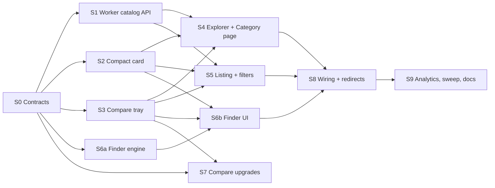

# Implementation plan: catalog discovery

This is the build plan for [CATALOG_DISCOVERY.md](./CATALOG_DISCOVERY.md). The streams are parallelisable, and each one owns its files so they do not collide. They are listed in dependency order.

## Ground rules

- **The theme migration lands first, or is rebased onto.** New UI uses semantic tokens only (`bg-canvas`, `bg-surface`, `bg-surface-raised`, `border-border-subtle`, `text-text-primary/secondary/muted`, `text-success`, `text-warning`, `text-gold`, `bg-charcoal` + `data-theme="dark"` for deliberately dark bands). Never use `text-white`, `bg-black` or `zinc-*` in new code. **Nobody in these streams edits `src/index.css`.** Any new utility goes in the component (Tailwind arbitrary values) or in a new `src/styles/catalog.css`, imported by the lazy pages only.
- **One card.** `src/components/home/ProductCard.tsx` becomes the only card. `Products.tsx` stops rendering its own.
- **Pure logic in `src/lib/**` and `worker/lib/**`** with unit tests (`node:test` + `node:sqlite`, as in the existing suite). Components stay thin.
- **Every new string** goes through `loc(ar, en)` with an `// OWNER: Sorani to be written by hand.` marker.
- **D1:** ≤ 100 bound params, lists as one `json_each(?)` param, and no `UNION` ladders.
- **Old links never break.** Each stream that moves a link keeps the old route working and adds a test for it.

## Dependency graph

Waves:
- **Wave 1:** S0.
- **Wave 2 (parallel):** S1, S2, S3, S6a, S7-server.
- **Wave 3 (parallel):** S4, S5, S6b, S7-client.
- **Wave 4:** S8, then S9.

---

## S0: Contracts (half a day, one engineer, lands alone)

**Owns:** `src/lib/catalog/types.ts` (new), `src/lib/catalog/listingQuery.ts` (new), `src/lib/finder/answers.ts` (new), and additive type fields in `src/lib/api.ts` (`ApiProduct.sale_types?`, `compare_type?`, `card_name?`, `created_at?`; `ResolvedCategory.path?`).

**Contents:**
- TypeScript shapes for `CatalogTreeNode`, `CategoryPayload`, `Shelf`, `FacetSet`, `ListingState`, `FinderAnswers`, `FinderResult`, `CompareLens`.
- `listingQuery.ts`: `parseListing(search) → ListingState` and `serializeListing(state) → string` (stable key order, defaults omitted).
- `answers.ts`: the same for the finder.

**Acceptance:**
- Round-trip tests for every parameter. An unknown value is dropped rather than thrown. Default state serialises to `''`.
- **Tests:** `tests/catalogListingQuery.test.ts`, `tests/finderAnswers.test.ts`.

## S1: Worker catalog API (2 to 3 days)

**Owns:**
- `migrations/01xx_catalog_presentation.sql` (new)
- `worker/routes/catalog.ts` (new)
- `worker/lib/catalogPresentation.ts` (new: shelves, smart shelves, brands)
- `worker/lib/listingFacets.ts` (new: facet extraction, filtering, sorting)
- The `productRoutes.get('/')` block and `CARD_FIELDS` in `worker/routes/products.ts`
- `worker/routes/adminTaxonomy.ts` (description and hero fields, slug `all` reserved)
- The taxonomy admin form in `src/components/adminTaxonomy/**`
- The `worker/index.ts` mount line

**Work:**
1. Migration: `catalogs.description_ar/en/ckb`, `hero_image_key`. Optionally `products.card_name TEXT NOT NULL DEFAULT ''` (pending Q2; ship the column, leave the UI behind a flag).
2. `GET /api/catalog/tree`: roll-up counts via `catalogMembership` with no caps, plus `available_count`. `Cache-Control: public, s-maxage=300` and the Cache API. Admin taxonomy writes call the purge.
3. `GET /api/catalog/:slug`: resolve by slug (then id), build `path`, then one subtree SELECT (cap 200), then the existing pricing, relations and offers batch. Shelves are grouped in memory with the rules from CATALOG_DISCOVERY §6. Signed-out responses are cached for 60 s.
4. `/api/products` gains `sort`, `avail`, `sale`, `price`, `brand`, `offer`, `member`, `f.*`, `facets=1`. The unfiltered path is byte-identical to today.
5. `CARD_FIELDS` adds `sale_types`, `created_at`, `compare_type`, `card_name`. `compare_type` comes from `productTypeForBranch` with a memoised catalogs map.
6. `ResolvedCategory.path`.

**Acceptance:**
- `/api/products?category=cat_printers` without new params returns the same JSON as before, excluding the new card fields (snapshot test).
- A request with 3 brands and 5 facets binds fewer than 20 params (asserted).
- A category with no products returns 404 from `:slug`. An inactive catalog that still has products still renders.
- `price_asc` orders by the **viewer-resolved** price (a test with a PRO viewer where the tier changes the order).
- Facet counts are disjunctive (a test).
- `truncated:true` above 300 candidates.

**Tests (new):** `tests/catalogTreeRoute.test.ts`, `tests/catalogPageRoute.test.ts`, `tests/listingFacets.test.ts`, `tests/listingSortResolvedPrice.test.ts`, `tests/listingParamBudget.test.ts`, `tests/adminTaxonomyDescription.test.ts`.
**Existing tests that must stay green:** `homeCategories`, `catalogRoutes`, `homeShelves`, `homeV2Layout`, `searchRoute*`.

## S2: Compact product card (1 to 2 days)

**Owns:** `src/components/home/ProductCard.tsx`, `src/components/CardPrice.tsx`, `src/components/product/AvailabilityLine.tsx` (new), `src/components/ui/Skeleton.tsx` (`ProductCardSkeleton` compact shape only), and `src/components/DirectStockEdge.tsx` (untouched, just no longer used by compact).

**Work:**
- Add `density: 'regular' | 'compact'` (default `compact` after S8), `compareToggle?: boolean`, and `width` (rail) props.
- Implement the spec in CATALOG_DISCOVERY §4: 6:5 top-anchored media, 12.5 px name, 15 px price, one member line, availability line.
- The compare toggle is a **sibling** button, not nested in the link, and its hit area is `.lv-hit`.
- `CardPrice compact` shows one member line (the cheapest rung below what the viewer pays).
- `AvailabilityLine` has three states and a quantity rule (≤ 2 gives «بقي N», using `low_stock_threshold` when present).

**Acceptance:**
- At 174 px wide the card is 262 ± 4 px tall, with or without member prices and with a 1-line or 2-line name. Measure it in the browser harness (`scripts/e2e-home-v2-shots.mjs` gets a card-height assertion).
- A PRO viewer sees no member line. A PRIME viewer sees a PRO line only if it is cheaper.
- There is no `<button>` inside `<a>` (lint rule or test).
- Availability text is present in the link's accessible name.

**Tests:** `tests/productCardCompact.test.ts` (render with `react-dom/server`: states, member line rules, availability copy), `tests/cardPriceCompact.test.ts`.

## S3: Compare tray (1 to 2 days)

**Owns:** `src/lib/compareTray.ts` (new), `src/components/compare/CompareTray.tsx` (new), `src/components/compare/CompareToggle.tsx` (new), `src/components/compare/CompareBadge.tsx` (new), and one mount line in `src/App.tsx` (inside the main shell, lazy).

**Work:**
- The external store (`useSyncExternalStore`) with `lv_compare_v1`, a schema version, 30-day expiry, cross-tab `storage` sync, and try/catch around storage. The API is `add`, `remove`, `clear`, `has`, `replaceAll(ids)`, `subscribe`.
- Type lock and max-4 behaviour. The conflict dialog uses `ConfirmDialog`.
- The tray is hidden on `/compare`, `/checkout*`, `/cart`, `/printer-finder`, `/admin*`, and the product page, where it becomes a badge.
- Clear shows an undo toast (5 s).

**Acceptance:**
- Private-mode (throwing storage) still works in memory.
- The 5th add is refused with a toast. A type conflict prompts.
- Two tabs converge.
- The entry chunk grows by ≤ 1.5 KB gzip (`tests/bundleBudget.test.ts` updated deliberately with a comment).

**Tests:** `tests/compareTrayStore.test.ts` (pure store with an injected storage), `tests/compareTrayRoutes.test.ts` (visibility rules).

## S4: Categories explorer and category page (2 to 3 days)

**Needs:** S1, S2, S3.
**Owns:** `src/pages/CategoriesExplorer.tsx`, `src/pages/CategoryPage.tsx`, and `src/components/catalog/**` (new files only: `CategoryBanner`, `SubCategoryChips`, `CategoryHero`, `CategoryStats`, `ShelfJumpChips`, `ProductShelf`, `BrandShelf`, `FinderBand`, `RelatedCategories`, `DiscoveryFooterTiles`, `PageTopBar`). **Reuses** `PromoPhoto`, `SectionHead`/`ArrowGlyph` (home v2), `useRail`, `pageCache`, `AsyncStates`, `SafeImage`.

**Work:**
- The pages as specified in CATALOG_DISCOVERY §5 and §6, including the "no sub-sections" fallback, which renders `CategoryListing` with a compact hero.
- Scroll-linked top-bar title and jump-chip scroll-spy with `IntersectionObserver`.
- Prefetch helpers in `src/lib/catalog/prefetch.ts`.

**Acceptance:**
- With today's live data (captured JSON fixtures from 2026-09-25):
  - the explorer shows 4 banners, with chips only under Printers and Maker's Supply;
  - `/categories/printers` shows an FDM shelf (10), «جاهزة للتسليم الآن» (4), «للطباعة بأكثر من لون» (≥ 3) and brands (2);
  - `/categories/printing-materials` renders as a listing.
- No Resin or Laser frame is drawn.
- Screenshots at 360/390/768/1280 in ar/en/ckb are added to the W6 sweep.

**Tests:** `tests/categoryPageModel.test.ts` (pure: shelf selection rules against fixtures), `tests/categoriesExplorerModel.test.ts`.

## S5: Listing, filters and sort (3 days)

**Needs:** S1, S2, S3.
**Owns:** `src/pages/CategoryListing.tsx` (new), `src/components/listing/**` (new: `ListingToolbar`, `FilterSheet`, `FacetSection`, `PriceFacet` (histogram, range, inputs), `CheckboxFacet`, `ChipFacet`, `SwatchFacet`, `SortSheet`, `QuickFilterChips`, `AppliedFilterChips`, `ResultCount`, `ProductGrid`, `ProductList`, `EmptyFiltered`, `LoadMore`), and **`src/pages/Products.tsx`**, which becomes a thin wrapper rendering `CategoryListing` in `search` or `all` mode and doing the `?category=` → `path` replace. **Reuses** `Sheet` (detents), `Segmented`, `Switch`, `LiveSearch`, `Spinner`, `AsyncStates`.

**Work:**
- CATALOG_DISCOVERY §7 in full: URL state via `listingQuery`, facet counts debounced and aborted, and apply-on-tap in the sheet.
- The desktop side column at 1024 px and wider.
- `content-visibility` on grid rows.
- The view toggle is remembered in `localStorage` (try/catch).

**Acceptance:**
- `/products?search=h2` behaves exactly as today (ranking, suggestion, load more), plus the toolbar.
- `/products?category=cat_printers_fdm` replaces to `/categories/printers/fdm-printers`.
- `/products?category=<legacy token>` still lists (the existing test).
- The filter sheet count matches the grid after apply.
- Back restores filters and scroll.
- Zero results offer per-filter undo with counts.

**Tests:** `tests/listingStateUrl.test.ts`, `tests/productsLegacyCategoryRedirect.test.ts`, `tests/listingEmptyUndo.test.ts`, plus the existing `tests/homeCategories.test.ts`.

## S6a: Finder engine (2 days, server, parallel with UI)

**Owns:** `worker/lib/printerFinder.ts` (new, pure), `worker/routes/printerFinder.ts` (new), the `worker/index.ts` mount line, and the `use_cases` / `has_laser_module` fields in `worker/lib/templateFamilies.ts` (device-core group, printer types only).

**Work:**
- The model in CATALOG_DISCOVERY §9: candidates via the same query as `handleChoosePrinter`; hard filters with labelled relaxation; normalised criteria; weights; the missing-is-zero rule; reason and caveat codes built from `readCompareValue`; `excluded` and `coverage`.
- `GET /api/printer-finder` and `/meta`.
- Add the new fields to the admin product form and the import template automatically (they are generated from `templateFamilies`). Check `tests/productFormParityAudit.test.ts` and the import-template tests.

**Acceptance:**
- Against the fixture of the 10 live printers:
  - business + FDM + 1.25–2.5M + any sale + [speed, colors] + intermediate gives X2D, H2S, P2S in that order, and U1 is `ranked_lower`;
  - no reason ever cites a missing field;
  - a quiet-first answer produces the coverage caveat;
  - direct-only with a budget under 750k relaxes with a label.
- **Tests:** `tests/printerFinderScoring.test.ts`, `tests/printerFinderRoute.test.ts`, `tests/printerFinderHonesty.test.ts` (property test: every reason's field is known on that product).

## S6b: Finder UI (2 to 3 days)

**Needs:** S6a (contract from S0; it can start on fixtures), S2, S3.
**Owns:** `src/pages/PrinterFinder.tsx` (new) and `src/components/finder/**` (new: `FinderChrome`, `FinderProgress`, `AnsweredChips`, `FinderStep`, `ChoiceTiles`, `ChoiceRows`, `BudgetOptions`, `FinderFooter`, `FinderResults`, `ResultHero`, `ResultRow`, `ReasonList`, `ExclusionDisclosure`, `HumanHelpBand`, `strings.ts`).

**Work:**
- CATALOG_DISCOVERY §8: auto-advance, skip, answered chips, focus management, reduced-motion fades, `replaceState` per answer, and the results with the tray integration.
- Save via `/api/profile/favorites/:id` (guest → `useSignInPrompt`).

**Acceptance:**
- Keyboard-only completion.
- A screen reader announces each question and the progress.
- Refresh on any step keeps the answers.
- Results link to the product, compare and support with the answers.

**Tests:** `tests/finderFlowModel.test.ts` (step machine: skip, back, edit), `tests/finderStrings.test.ts` (every reason code has ar/en copy).

## S7: Compare upgrades (2 to 3 days; the server part in wave 2, the client part in wave 3)

**Owns:**
- Server: `worker/lib/compareLenses.ts` (new), the `compareProducts` result extension, and the `release_year` formatting fix in `worker/lib/compareSpecs.ts`.
- Client: `src/lib/compare.ts` (types), `src/pages/Compare.tsx`, and `src/components/compare/{LensBar,BestForSummary,StickyColumns,RowBars}.tsx` (new). Edits to `SpecTable.tsx` for bars, the direction hint and deltas, and to `CompareSlots.tsx` for move buttons.
- The product-page compare button toggle: `src/pages/Product.tsx`, only the `data-product-compare` block.

**Work:**
- Lenses as in CATALOG_DISCOVERY §10.2.
- The sticky collapsing header.
- «الفروقات فقط» on by default for ≥ 3 products.
- Two-way sync with the tray.
- LTR isolation of values.

**Acceptance:**
- For the X2D/H2S/P2S fixture the lenses are business → H2S, beginners → P2S, value → X2D, multicolor → X2D, precision → X2D.
- `release_year` renders «2025».
- 22 identical rows are hidden and the count is shown.
- `?lens=` round-trips.
- Existing compare tests stay green.

**Tests:** `tests/compareLenses.test.ts`, `tests/compareYearFormat.test.ts`, plus the existing `compareSpecs`, `compareAxesAndAdd`, `compareLikeWithLike`, `compareOptionSlots` and `supportCompare`.

## S8: Wiring and route migration (1 day)

**Needs:** S4, S5, S6b.
**Owns:** `src/App.tsx` (routes), `src/lib/homeLayout.ts` (`BentoTile.to`), `src/components/home/v2/{CategoryBento,PrinterFinder,LatestProducts,EditorialBanners}.tsx` (link targets only), `worker/routes/support.ts` (the finder card in `choose_printer` and the `finder=` intake), and `worker/routes/seo.ts` (sitemap and canonical).

**Work:**
- Routes `/categories`, `/categories/:categorySlug`, `/categories/:categorySlug/:subCategorySlug`, `/printer-finder` (all lazy).
- Bento tiles go to `/categories/<slug>`. «عرض جميع الفئات» goes to `/categories`. «ساعدني أختار» goes to `/printer-finder`. The «أحدث المنتجات» cards get `compareToggle`.
- The editorial banners go to category paths.
- `/support?ask=choose_printer` keeps working and now offers the finder.
- The listing grid and home rail switch to `density="compact"`.

**Acceptance:**
- Every old link in the table below resolves.
- `tests/homeV2Layout.test.ts` is updated for the new `to`, and the owner's order is unchanged.

| Old | New behaviour |
|---|---|
| `/products?category=<id or slug>` | `replace` to `/categories/<root>[/]`, or keeps listing for a legacy token |
| `/products` | «كل المنتجات» listing (unchanged URL) |
| `/products?search=` | unchanged URL, new toolbar |
| `/support?ask=choose_printer` | unchanged, plus a finder card |
| `/compare?ids=` | unchanged, plus lenses and tray sync |

## S9: Analytics, sweep, docs (1 to 2 days)

**Owns:** `src/lib/track.ts` (new; no-op until Q9), `worker/routes/events.ts` (only if the owner approves), `scripts/e2e-w6-sweep.mjs` (add routes), `scripts/e2e-home-v2-shots.mjs` (card height), `docs/DECISIONS.md` (one row), and `docs/ux/*` (status).

**Acceptance:**
- The W6 sweep is clean on the new routes: 44 px targets, no horizontal overflow at 320 px, AA contrast in both themes, focus visible, and no infinite motion under reduced motion.
- Lighthouse mobile on `/categories/printers`: LCP < 2.5 s on "Fast 3G" with a cached shell, CLS < 0.05.

---

## File ownership matrix (to avoid collisions)

| File or area | Stream |
|---|---|
| `src/index.css` | **nobody** (theme migration owner) |
| `src/lib/api.ts` (types only) | S0 |
| `worker/routes/products.ts`, `CARD_FIELDS` | S1 |
| `worker/routes/adminTaxonomy.ts`, `src/components/adminTaxonomy/**`, migration | S1 |
| `src/components/home/ProductCard.tsx`, `CardPrice.tsx`, `Skeleton.tsx` | S2 |
| `src/lib/compareTray.ts`, new compare tray components | S3 |
| `src/pages/CategoriesExplorer.tsx`, `CategoryPage.tsx`, `src/components/catalog/**` | S4 |
| `src/pages/CategoryListing.tsx`, `src/pages/Products.tsx`, `src/components/listing/**` | S5 |
| `worker/lib/printerFinder.ts`, `worker/routes/printerFinder.ts`, `templateFamilies.ts` (2 fields) | S6a |
| `src/pages/PrinterFinder.tsx`, `src/components/finder/**` | S6b |
| `worker/lib/compareSpecs.ts`, `compareLenses.ts`, `src/pages/Compare.tsx`, `src/components/compare/*` (existing files), `Product.tsx` compare block | S7 |
| `src/App.tsx`, `src/lib/homeLayout.ts`, `src/components/home/v2/*`, `worker/routes/support.ts`, `seo.ts` | S8 |
| `worker/index.ts` | S1, S6a (one mount line each; merge trivially) |

## Rollout

1. S1, S3 and S7-server ship dark (no UI links).
2. S2 ships: it changes cards everywhere, so owner review uses screenshots from the home-v2 harness.
3. S4, S5 and S6b ship behind the route. There are no home links yet, so the owner can preview `/categories` directly.
4. S8 flips the home links after the owner's OK. Keep a one-line revert: the bento `to` returns to `/products?category=`.
5. Fill the data (Q6), then enable `use_cases` in the finder weights. Until then, `use_fit` weight is 0 automatically, because it is absent.
